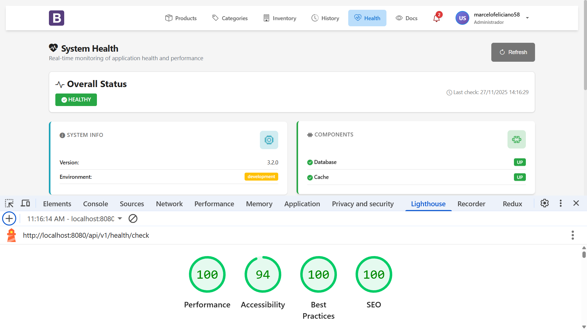

# 📸 UI/UX Architecture & Technical Showcase

> Java/JSO frontend implementation with accessibility-first design, performance optimization, and modern CSS
> architecture.

## Table of Contents

- [Design System Architecture](#design-system-architecture)
- [Application Interfaces](#application-interfaces)
    - [Product Management](#product-management)
    - [Health Monitoring Dashboard](#health-monitoring-dashboard)
    - [Activity History & Audit Trail](#activity-history--audit-trail)
- [Technical Implementation](#technical-implementation)

---

## Design System Architecture

### CSS Architecture & Methodology

#### Modular CSS Structure

```
css/
├── variables.css        → Design tokens (CSS Custom Properties)
├── styles.css          → Base styles, typography, grid system
├── navbar.css          → Navigation component encapsulation
├── components.css      → Reusable UI components
├── dark-mode.css       → Dark theme overrides (prefers-color-scheme)
├── fixes.css           → Cross-browser compatibility patches
└── login.css           → Authentication pages (isolated scope)
```

---

## Application Interfaces

### Home Page

<p align="center">
  
  <br>
  <em>Home page</em>
</p>
---

## Health Monitoring Dashboard

### Real-Time System Observability

<p align="center">
  
  <br>
  <em>Product view interface</em>
</p>

<p align="center">
  
  <br>
  <em>Readiness probe endpoint with dependency health checks</em>
</p>

## Activity History & Audit Trail

### Audit Logging UI

<p align="center">
  
  <br>
  <em>Timeline view with event filtering and correlation tracking</em>
</p>

<p align="center">
  
  <br>
  <em>Light theme variant with optimized contrast for daytime viewing</em>
</p>
<p align="center">
  
  <br>
  <em>Documentation page with code samples and Endpoint references</em>
</p>

### Technical Implementation

#### Audit Log Schema

```json
{
  "schemaVersion": "1.0",
  "correlationId": "7b558145-e976-4536-bee1-b375026ee973",
  "event": "product:find_by_id",
  "outcome": "SUCCESS",
  "timestamp": "2025-11-25T16:15:02.089861800Z",
  "httpMethod": "GET",
  "userId": "85f66ff4-6b90-4bb8-aa20-9b9ea78e2014",
  "endpoint": "/api/v1/product/list/01148ae5-fc1b-4246-8817-e3bc5b4311dc",
  "payload": {
    "input": {
      "id": "01148ae5-fc1b-4246-8817-e3bc5b4311dc"
    },
    "output": {
      "id": "01148ae5-fc1b-4246-8817-e3bc5b4311dc",
      "name": "Women's High Heel Sandals",
      "description": "Step out in style with our Women's High Heel Sandals. These sandals feature a strappy design that adds a touch of elegance to any outfit. The comfortable footbed and sturdy heel make them perfect for a night out, while the buckle closure ensures a secure fit. Choose from black, red, nude, or silver to complement your wardrobe.",
      "url": "any-url-here",
      "status": "A",
      "registerDate": 1763953200000,
      "price": 59.99
    }
  },
  "ipAddress": "72.14.201.219",
  "startedAt": "1764087302076",
  "userAgent": "Mozilla/5.0 (Windows NT 10.0; Win64; x64) AppleWebKit/537.36 (KHTML, like Gecko) Chrome/142.0.0.0 Safari/537.36"
}
```

**CSS Implementation:**

```css
.card {
    background: var(--card-bg);
    border-radius: var(--border-radius-lg);
    box-shadow: var(--shadow-sm);
    overflow: hidden;
    transition: box-shadow var(--transition-base);
}
```

### Button System

#### Reusable Components

```js
<!-- Search Component -->
<jsp:include page="/WEB-INF/view/components/search.jsp">
    <jsp:param name="placeholder" value="Search product"/>
    <jsp:param name="action" value="${baseLink}${version}${ searchProduct }"/>
    <jsp:param name="onclear" value="${baseLink}${version}${ listProduct }"/>
    <jsp:param name="limit" value="${ pageable.getPageSize() }"/>
    <jsp:param name="categories" value="${ categories }"/>
    <jsp:param name="searchType" value="name"/>
</jsp:include>

<!-- Custom Button -->
<button type="${param.btnType}"
        class="${param.btnClass}"
        ${param.btnDisabled}
        ${param.btnOnclick}
        ${param.btnId}>
    <i class="${param.btnIcon}"></i>
    ${param.btnLabel}
</button>

<!-- Custom Button usage -->
<jsp:include page="/WEB-INF/view/components/buttons/customButton.jsp">
    <jsp:param name="btnLabel" value="Back"/>
    <jsp:param name="btnType" value="button"/>
    <jsp:param name="btnClass" value="btn btn-light"/>
    <jsp:param name="btnIcon" value="bi bi-arrow-left"/>
    <jsp:param name="btnOnclick" value="onclick='history.back()'"/>
    <jsp:param name="btnId" value="id='backButton'"/>
</jsp:include>

<!-- Custom Pagination Component -->
<jsp:include page="/WEB-INF/view/components/pagination.jsp">
    <jsp:param name="pageable" value="${pageable}"/>
</jsp:include>
```

### Technical Architecture

#### Product View Implementation

```java
/**
 * Note: if the interfaces have any @ injections, the framework will handle it automatically
 */
@Controller("product")
public interface ProductControllerApi {

    @RequestMapping(value = "/create", method = POST, jsonType = ProductRequest.class)
    IHttpResponse<Void> register(ProductRequest request, @Authorization String auth);

    @RequestMapping("/new")
    IHttpResponse<Collection<CategoryResponse>> forward(@Authorization String auth);

    @RequestMapping(value = "/list", jsonType = ProductRequest.class)
    IServletResponse list(IPageRequest pageRequest, @Authorization String auth);

    @RequestMapping(value = "/list/{id}", jsonType = ProductRequest.class)
    IHttpResponse<ProductResponse> findById(ProductRequest request, @Authorization String auth);

    @RequestMapping(value = "/update/{id}", method = POST, jsonType = ProductRequest.class)
    IHttpResponse<Void> update(ProductRequest request, @Authorization String auth);

    @RequestMapping(value = "/scrape", method = POST)
    IHttpResponse<Void> scrape(@Authorization String auth, 
                               @Property("app.env") String environment, 
                               @Property("scrape_product_url") String url);
}
```

```java
@Singleton
public class ProductController extends BaseController implements ProductControllerApi {

    public IHttpResponse<Void> register(ProductRequest request, String auth) throws ServiceException {
        ProductResponse product = productService.create(request, auth);
        return newHttpResponse(201, redirectTo(product.getId()));
    }
}
```

#### Auth Service Implementation

```java

@Slf4j
@ApplicationScoped
@NoArgsConstructor
public class LoginUseCase implements LoginPort {
    private static final String EVENT_NAME = "user:login";

    @Inject
    private UserMapper userMapper;
    @Inject
    private AuditPort auditPort;
    @Inject
    private GetUserPort userPort;
    @Inject
    private AuthenticationPort authenticationPort;
    @Inject
    private RefreshTokenRepository refreshTokenRepository;

    @Override
    public IHttpResponse<UserResponse> login(LoginRequest request, String onSuccess) throws ApplicationException {
        String login = request.login();
        String password = request.password();

        log.debug("LoginUseCase: attempting login for user {}", login);

        try {
            UserRequest userRequest = new UserRequest(login, password);

            User user = userPort.get(userRequest).orElse(null);
            if (user == null) {
                auditPort.failure(EVENT_NAME, null, new AuditPayload<>(request, null));
                throw new ApplicationException("Invalid login or password");
            }

            if (Status.PENDING.equals(user.getStatus())) {
                auditPort.warning(EVENT_NAME, null, new AuditPayload<>(request, null));
                UserResponse userResponse = UserResponse.builder()
                        .id(user.getId())
                        .unconfirmedEmail(true)
                        .build();
                return HttpResponse.ok(userResponse).next("forward:pages/formLogin.jsp").build();
            }

            UserResponse response = userMapper.toResponse(user);
            String accessToken = authenticationPort.generateAccessToken(user);
            String refreshJwt = authenticationPort.generateRefreshToken(user);
            log.debug("LoginUseCase: generated access and refresh tokens for user {}", user.getId());

            RefreshToken rt = RefreshToken.builder()
                    .token(authenticationPort.stripBearerPrefix(refreshJwt))
                    .user(user)
                    .revoked(false)
                    .issuedAt(Instant.now())
                    .expiresAt(Instant.now().plusSeconds(TimeUnit.DAYS.toSeconds(30)))
                    .build();
            refreshTokenRepository.save(rt);
            log.debug("LoginUseCase: user {} logged in successfully", user.getId());

            response.setToken(accessToken);
            response.setRefreshToken(refreshJwt);

            auditPort.success(EVENT_NAME, response.getToken(), null);
            return HttpResponse.ok(response).next(onSuccess).build();

        } catch (Exception e) {
            auditPort.warning(EVENT_NAME, null, new AuditPayload<>(request, null));

            return HttpResponse.<UserResponse>newBuilder()
                    .statusCode(HttpServletResponse.SC_UNAUTHORIZED)
                    .error("Invalid login or password")
                    .reasonText("Unauthorized")
                    .next("forward:pages/formLogin.jsp")
                    .build();
        }
    }
}
```

### Auth Filter Implementation

```java

@Slf4j
@ApplicationScoped
@NoArgsConstructor
public class AuthFilter implements Filter {

    @Override
    public void doFilter(ServletRequest servletRequest, ServletResponse servletResponse, FilterChain chain) throws IOException {
        HttpServletRequest httpRequest = (HttpServletRequest) servletRequest;
        HttpServletResponse httpResponse = (HttpServletResponse) servletResponse;

        boolean isAuthorized = isAuthorizedRequest(httpRequest);
        if (isAuthorized) {
            dispatcher.dispatch(httpRequest, httpResponse);
            return;
        }

        String token = AuthCookiePort.getTokenFromCookie(httpRequest, AuthCookiePort.getAccessTokenCookieName());
        String refreshToken = AuthCookiePort.getTokenFromCookie(httpRequest, AuthCookiePort.getRefreshTokenCookieName());
        if (token == null && refreshToken == null) {
            log.warn("No tokens found for: {}, redirecting to login page", httpRequest.getRequestURI());
            redirectToLogin(httpResponse);
            return;
        }

        boolean tokenValid = token != null && authenticationPort.validateToken(token);
        if (tokenValid) {
            log.debug("Valid token access [endpoint={}]", httpRequest.getRequestURI());
            dispatcher.dispatch(httpRequest, httpResponse);
            return;
        }

        if (refreshToken != null && authenticationPort.validateToken(refreshToken)) {
            try {
                RefreshTokenResponse refreshTokenResponse = RefreshTokenPort.refreshToken(BEARER_PREFIX + refreshToken);
                AuthCookiePort.setAuthCookies(httpResponse, refreshTokenResponse.token(), refreshTokenResponse.refreshToken());
                httpResponse.setStatus(HttpServletResponse.SC_FOUND);
                httpResponse.sendRedirect(httpRequest.getRequestURI());
                return;
            } catch (ApplicationException e) {
                log.error("Failed to refresh token, redirecting to login page", e);
            }
        }

        log.warn("Both tokens are invalid for: {}, redirecting to login page", httpRequest.getRequestURI());
        AuthCookiePort.clearCookies(httpResponse);
        redirectToLogin(httpResponse);
    }
}
```

### MVC Request Flow

The framework's MVC flow starts with the `ServletDispatcherImpl.dispatch()` method, which:

1. Applies rate limiting using a Leaky Bucket algorithm (Header: X-Rate-Limit).
2. Builds a `Request` object from the `HttpServletRequest` (decoupling HttpServletRequest/Response).
3. Calls `HttpExecutor.call()` to resolve the controller and invoke the method.
4. Processes the response, sets headers (e.g., X-Correlation-ID), and forwards or redirects based on the `IHttpResponse.next()` value.

Controllers extend `BaseRouterController`, which uses reflection to map endpoints to methods annotated with `@RequestMapping`. Dependency injection is handled by CDI.


### Package Structure

```text
C:.
├───main
│   ├───java
│   │   └───com
│   │       └───dev
│   │           └───servlet
│   │               ├───adapter
│   │               │   ├───in
│   │               │   │   ├───alert
│   │               │   │   ├───messaging
│   │               │   │   │   └───consumer
│   │               │   │   ├───web
│   │               │   │   │   ├───annotation
│   │               │   │   │   ├───builder
│   │               │   │   │   ├───controller
│   │               │   │   │   │   └───internal
│   │               │   │   │   │       └───base
│   │               │   │   │   ├───dispatcher
│   │               │   │   │   │   └───impl
│   │               │   │   │   ├───dto
│   │               │   │   │   ├───filter
│   │               │   │   │   │   └───wrapper
│   │               │   │   │   ├───introspection
│   │               │   │   │   ├───listener
│   │               │   │   │   ├───ratelimit
│   │               │   │   │   │   └───internal
│   │               │   │   │   ├───util
│   │               │   │   │   ├───validator
│   │               │   │   │   │   └───internal
│   │               │   │   │   └───vo
│   │               │   │   └───ws
│   │               │   └───out
│   │               │       ├───audit
│   │               │       ├───cache
│   │               │       ├───external
│   │               │       │   └───webscrape
│   │               │       │       ├───api
│   │               │       │       ├───builder
│   │               │       │       ├───service
│   │               │       │       └───transfer
│   │               │       ├───messaging
│   │               │       │   ├───adapter
│   │               │       │   ├───config
│   │               │       │   ├───factory
│   │               │       │   └───registry
│   │               │       └───security
│   │               ├───application
│   │               │   ├───exception
│   │               │   ├───mapper
│   │               │   ├───port
│   │               │   │   ├───contracts
│   │               │   │   ├───in
│   │               │   │   │   ├───activity
│   │               │   │   │   ├───auth
│   │               │   │   │   ├───category
│   │               │   │   │   ├───product
│   │               │   │   │   ├───stock
│   │               │   │   │   └───user
│   │               │   │   └───out
│   │               │   │       ├───audit
│   │               │   │       ├───cache
│   │               │   │       ├───category
│   │               │   │       ├───confirmtoken
│   │               │   │       ├───inventory
│   │               │   │       ├───product
│   │               │   │       ├───refreshtoken
│   │               │   │       ├───security
│   │               │   │       └───user
│   │               │   ├───transfer
│   │               │   │   ├───request
│   │               │   │   └───response
│   │               │   └───usecase
│   │               │       ├───activity
│   │               │       ├───auth
│   │               │       ├───category
│   │               │       ├───product
│   │               │       ├───stock
│   │               │       └───user
│   │               ├───domain
│   │               │   ├───entity
│   │               │   │   └───enums
│   │               │   └───enums
│   │               ├───infrastructure
│   │               │   ├───config
│   │               │   ├───health
│   │               │   │   └───internal
│   │               │   ├───migration
│   │               │   ├───persistence
│   │               │   │   ├───repository
│   │               │   │   │   └───base
│   │               │   │   └───transfer
│   │               │   │       └───internal
│   │               │   ├───security
│   │               │   └───utils
│   │               └───shared
│   │                   ├───enums
│   │                   ├───util
│   │                   └───vo
│   ├───resources
│   │   ├───db
│   │   │   └───migration
│   │   ├───META-INF
│   │   └───mockito-extensions
│   └───webapp
│       ├───META-INF
│       ├───resources
│       │   ├───assets
│       │   │   └───images
│       │   ├───css
│       │   ├───dist
│       │   └───js
│       └───WEB-INF
│           ├───classes
│           │   └───META-INF
│           ├───fragments
│           ├───routes
│           ├───tags
│           └───view
│               ├───components
│               │   └───buttons
│               └───pages
│                   ├───activity
│                   ├───category
│                   ├───health
│                   ├───inspect
│                   ├───inventory
│                   ├───product
│                   └───user

```