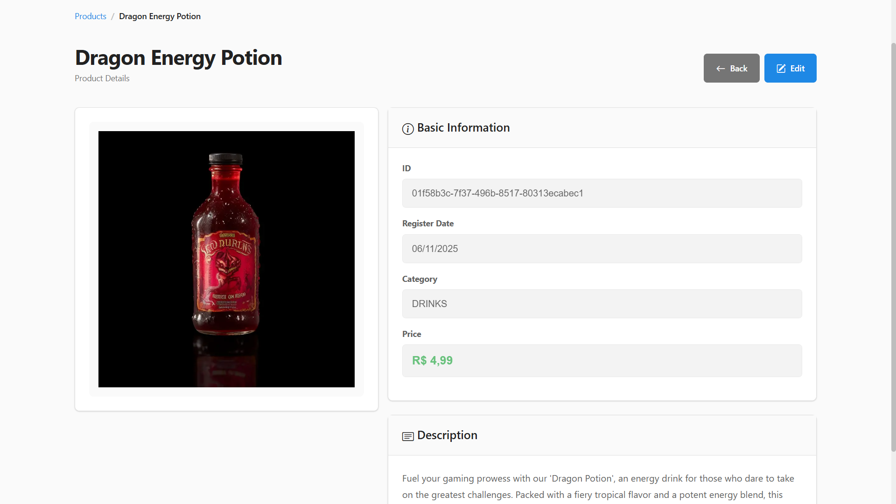
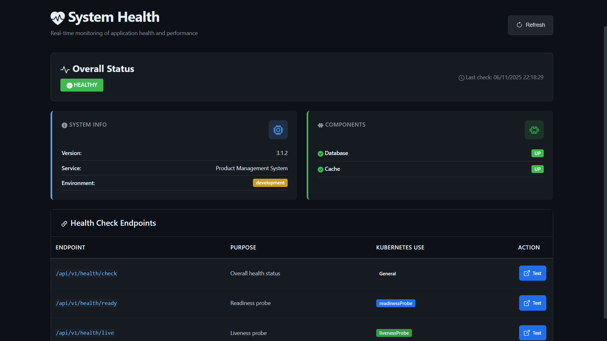
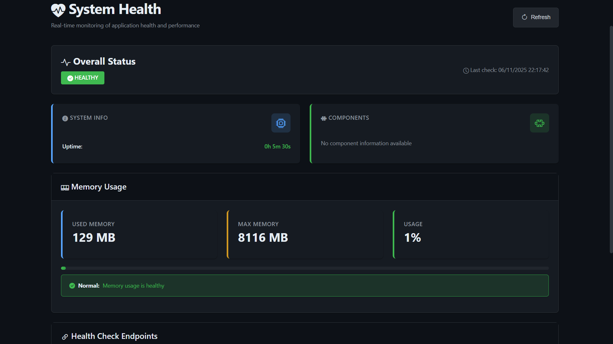
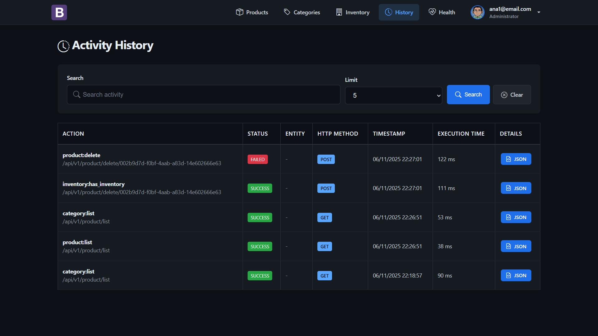
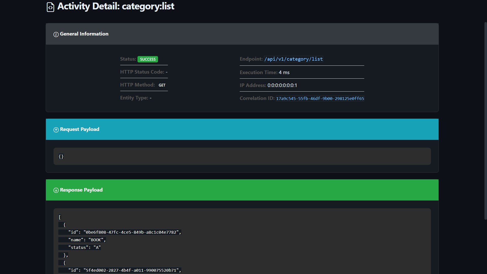
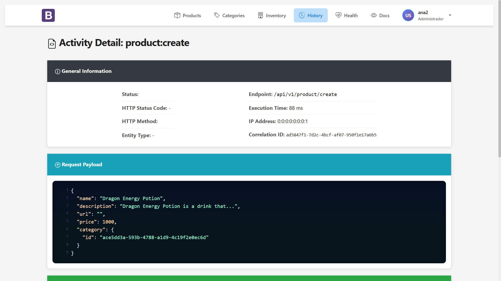

# 📸 UI/UX Architecture & Technical Showcase

> Java/JSO frontend implementation with accessibility-first design, performance optimization, and modern CSS
> architecture.

## Table of Contents

- [Design System Architecture](#design-system-architecture)
- [Application Interfaces](#application-interfaces)
    - [Product Management](#product-management)
    - [Health Monitoring Dashboard](#health-monitoring-dashboard)
    - [Activity History & Audit Trail](#activity-history--audit-trail)
- [Technical Implementation](#technical-implementation)

---

## Design System Architecture

### CSS Architecture & Methodology

#### Modular CSS Structure

```
css/
├── variables.css        → Design tokens (CSS Custom Properties)
├── styles.css          → Base styles, typography, grid system
├── navbar.css          → Navigation component encapsulation
├── components.css      → Reusable UI components
├── dark-mode.css       → Dark theme overrides (prefers-color-scheme)
├── fixes.css           → Cross-browser compatibility patches
└── login.css           → Authentication pages (isolated scope)
```

---

## Application Interfaces

### Product Management

<p align="center">
  
  <br>
  <em>Data grid with server-side pagination, sorting, and filtering</em>
</p>

---

## Health Monitoring Dashboard

### Real-Time System Observability

<p align="center">
  
  <br>
  <em>Product view interface</em>
</p>

<p align="center">
  
  <br>
  <em>Readiness probe endpoint with dependency health checks</em>
</p>

## Activity History & Audit Trail

### Audit Logging UI

<p align="center">
  
  <br>
  <em>Searchable audit trail with advanced filtering and correlation tracking</em>
</p>

<p align="center">
  
  <br>
  <em>JSON payload viewer with syntax highlighting and tree navigation</em>
</p>

<p align="center">
  
  <br>
  <em>Light theme variant with optimized contrast for daytime viewing</em>
</p>

### Technical Implementation

#### Audit Log Schema

```json
{
  "schemaVersion": "1.0",
  "event": "product:update",
  "timestamp": "2025-11-06T23:45:12.345678Z",
  "correlationId": "a1b2c3d4-e5f6-7890-abcd-ef1234567890",
  "outcome": "success",
  "userId": "admin-001",
  "httpMethod": "PUT",
  "endpoint": "/api/v1/products/update/002b9d7d-f0bf-4aab-a83d-14e602666e63",
  "executionTimeMs": 25,
  "payload": {
    "input": {
      "id": "002b9d7d-f0bf-4aab-a83d-14e602666e63",
      "name": "Product 2",
      "price": 89.99
    },
    "output": {
      "id": "002b9d7d-f0bf-4aab-a83d-14e602666e63",
      "name": "Product 2",
      "price": 169.99
    }
  },
  "metadata": {
    "ip": "192.168.1.100",
    "userAgent": "Mozilla/5.0...",
    "sessionId": "sess-xyz"
  }
}
```

**CSS Implementation:**

```css
.card {
    background: var(--card-bg);
    border-radius: var(--border-radius-lg);
    box-shadow: var(--shadow-sm);
    overflow: hidden;
    transition: box-shadow var(--transition-base);
}
```

### Button System

#### Reusable Components

```js
<!-- Search Component -->
<jsp:include page="/WEB-INF/view/components/search.jsp">
    <jsp:param name="placeholder" value="Search product"/>
    <jsp:param name="action" value="${baseLink}${version}${ searchProduct }"/>
    <jsp:param name="onclear" value="${baseLink}${version}${ listProduct }"/>
    <jsp:param name="limit" value="${ pageable.getPageSize() }"/>
    <jsp:param name="categories" value="${ categories }"/>
    <jsp:param name="searchType" value="name"/>
</jsp:include>

<!-- Custom Button -->
<button type="${param.btnType}"
        class="${param.btnClass}"
        ${param.btnDisabled}
        ${param.btnOnclick}
        ${param.btnId}>
    <i class="${param.btnIcon}"></i>
    ${param.btnLabel}
</button>

<!-- Custom Button usage -->
<jsp:include page="/WEB-INF/view/components/buttons/customButton.jsp">
    <jsp:param name="btnLabel" value="Back"/>
    <jsp:param name="btnType" value="button"/>
    <jsp:param name="btnClass" value="btn btn-light"/>
    <jsp:param name="btnIcon" value="bi bi-arrow-left"/>
    <jsp:param name="btnOnclick" value="onclick='history.back()'"/>
    <jsp:param name="btnId" value="id='backButton'"/>
</jsp:include>

<!-- Custom Pagination Component -->
<jsp:include page="/WEB-INF/view/components/pagination.jsp">
    <jsp:param name="pageable" value="${pageable}"/>
</jsp:include>
```

### Technical Architecture

#### Health Check Implementation

```java

/**
 * The annotations @Controller and @RequestMapping are build from scratch.
 * The @Inject annotation is a Java EE annotation used to inject
 * dependencies into the controller class.
 *
 * @author marcelo.feliciano
 * @version 1.0
 * @since 2022-012-01
 */
@Slf4j
@NoArgsConstructor
@Controller("health")
public class HealthController extends BaseController {
    private static final String HEALTH_PAGE = "forward:pages/health/health.jsp";
    // Dependencies are hidden to avoid excessive code length

    @RequestMapping(value = "/check", method = GET)
    public IHttpResponse<Map<String, Object>> health() {
        Map<String, Object> health = healthService.getHealthStatus();
        return HttpResponse.ok(health).next(HEALTH_PAGE).build();
    }
}
```

#### Product View Implementation

```java

@NoArgsConstructor
@Slf4j
@Singleton
@Controller("product")
public class ProductController extends BaseController {
    // Dependencies are hidden to avoid excessive code length

    @RequestMapping(value = "/create", method = POST, jsonType = ProductRequest.class) // Custom annotation
    public IHttpResponse<Void> create(ProductRequest request, @Authentication String auth) throws ServiceException {
        ProductResponse product = productService.create(request, auth);
        return newHttpResponse(201, redirectTo(product.getId()));
    }
}
```

#### Auth Service Implementation

```java

@Slf4j
@NoArgsConstructor
@Singleton
public class AuthServiceImpl implements AuthService {

    @Inject
    private UserMapper userMapper;
    @Inject
    private AuditService auditService;
    @Inject
    private IUserService userService;
    @Inject
    private JwtUtil jwtUtil;

    @Override
    public RefreshTokenResponse refreshToken(String refreshToken) throws ServiceException {
        if (!jwtUtil.validateToken(refreshToken)) {
            auditService.auditFailure("auth:refresh_token", refreshToken, null);
            throw new ServiceException("Invalid refresh token");
        }

        User user = jwtUtil.getUser(refreshToken);
        UserResponse userResponse = userService.getById(new UserRequest(user.getId()), refreshToken);
        user.setPerfis(userResponse.getPerfis());
        String newToken = jwtUtil.generateAccessToken(user);
        CacheUtils.clearAll(user.getId());
        var refreshTokenResponse = new RefreshTokenResponse(newToken);
        auditService.auditSuccess("auth:refresh_token", refreshToken, new AuditPayload<>(null, refreshTokenResponse));
        return refreshTokenResponse;
    }
}
```

### Auth Filter Implementation

```java
/**
 * The AuthFilter handles JWT authentication, refresh token rotation, and pre-authorized endpoints.
 * It integrates with the audit service for logging authentication events.
 *
 * @author marcelo.feliciano
 * @version 1.0
 * @since 2022-12-01
 */
@Slf4j
@NoArgsConstructor
public class AuthFilter implements Filter {
    // Dependencies are hidden to avoid excessive code length

    @Override
    public void doFilter(ServletRequest servletRequest, ServletResponse servletResponse, FilterChain chain) throws IOException {
        HttpServletRequest httpRequest = (HttpServletRequest) servletRequest;
        HttpServletResponse httpResponse = (HttpServletResponse) servletResponse;

        boolean isAuthorized = isAuthorizedRequest(httpRequest);
        if (isAuthorized) {
            dispatcher.dispatch(httpRequest, httpResponse);
            return;
        }

        String token = cookieService.getTokenFromCookie(httpRequest, cookieService.getAccessTokenCookieName());
        String refreshToken = cookieService.getTokenFromCookie(httpRequest, cookieService.getRefreshTokenCookieName());

        if (token == null && refreshToken == null) {
            redirectToLogin(httpResponse);
            return;
        }

        boolean tokenValid = token != null && jwtUtil.validateToken(token);
        if (tokenValid) {
            dispatcher.dispatch(httpRequest, httpResponse);
            return;
        }

        if (refreshToken != null && jwtUtil.validateToken(refreshToken)) {
            RefreshTokenResponse refreshTokenResponse = loginService.refreshToken(BEARER_PREFIX + refreshToken);
            cookieService.setAccessTokenCookie(httpResponse, refreshTokenResponse.token());
            httpResponse.setStatus(HttpServletResponse.SC_FOUND);
            httpResponse.sendRedirect(httpRequest.getRequestURI());
            return;
        }

        cookieService.clearAuthCookies(httpResponse);
        redirectToLogin(httpResponse);
    }
}
```

### MVC Request Flow

The framework's MVC flow starts with the `ServletDispatcherImpl.dispatch()` method, which:

1. Applies rate limiting using a Leaky Bucket algorithm.
2. Builds a `Request` object from the `HttpServletRequest`.
3. Calls `HttpExecutor.call()` to resolve the controller and invoke the method.
4. Processes the response, sets headers (e.g., X-Correlation-ID), and forwards or redirects based on the `IHttpResponse.next()` value.

Controllers extend `BaseRouterController`, which uses reflection to map endpoints to methods annotated with `@RequestMapping`. Dependency injection is handled by CDI.
