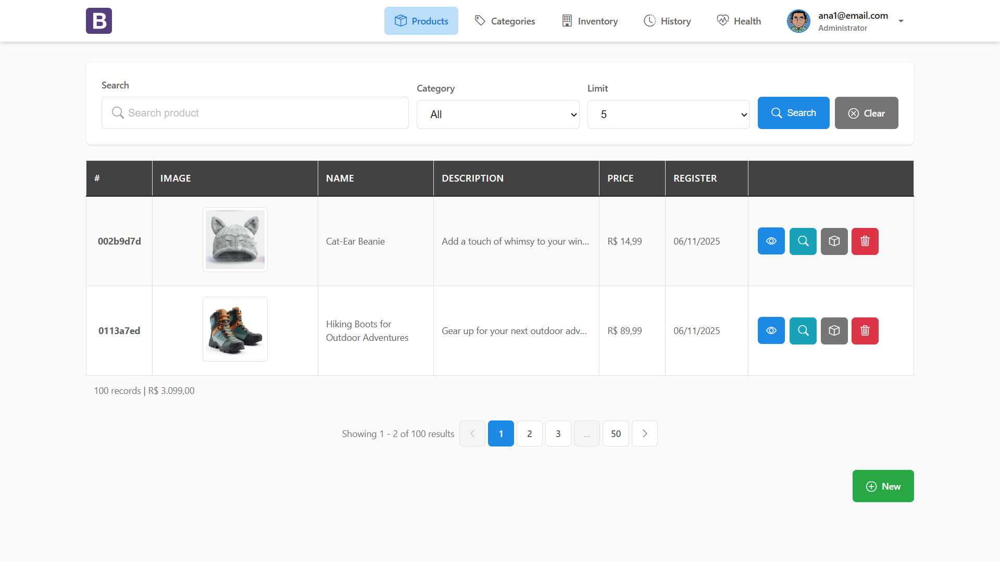
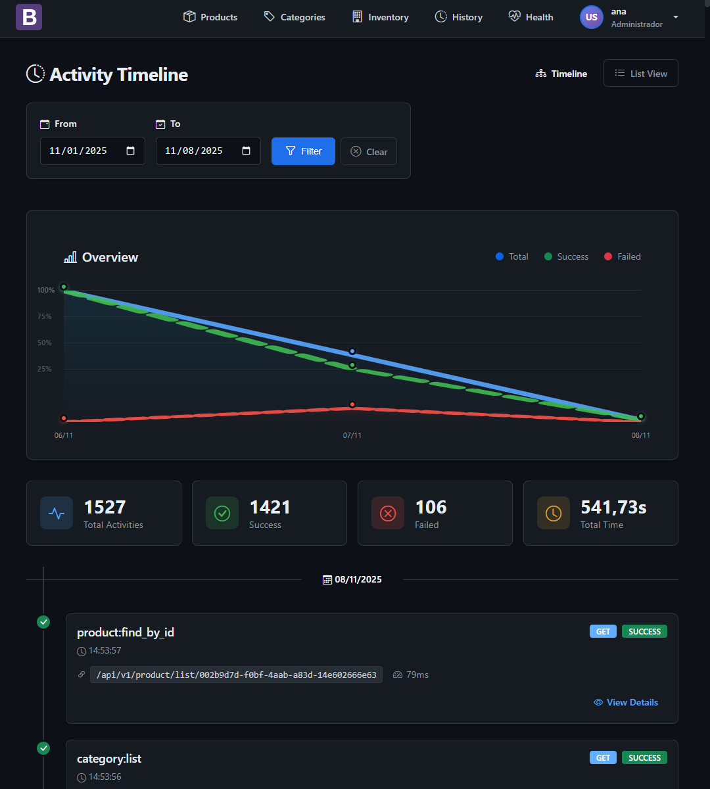
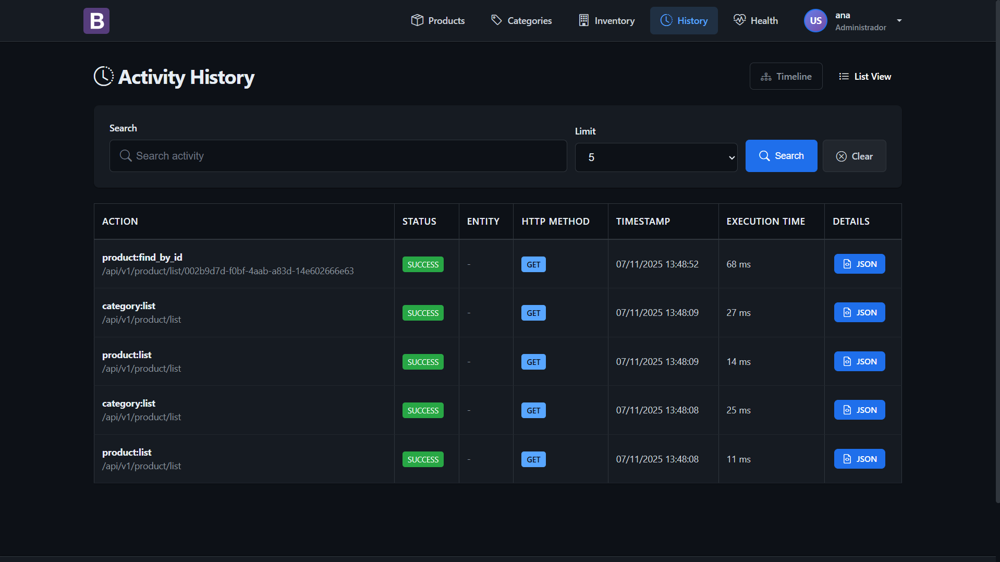
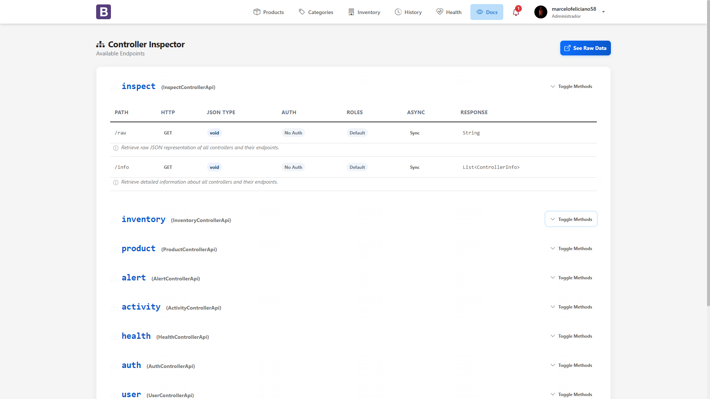

# 📸 UI/UX Architecture & Technical Showcase

> Java/JSO frontend implementation with accessibility-first design, performance optimization, and modern CSS
> architecture.

## Table of Contents

- [Design System Architecture](#design-system-architecture)
- [Application Interfaces](#application-interfaces)
    - [Product Management](#product-management)
    - [Health Monitoring Dashboard](#health-monitoring-dashboard)
    - [Activity History & Audit Trail](#activity-history--audit-trail)
- [Technical Implementation](#technical-implementation)

---

## Design System Architecture

### CSS Architecture & Methodology

#### Modular CSS Structure

```
css/
├── variables.css        → Design tokens (CSS Custom Properties)
├── styles.css          → Base styles, typography, grid system
├── navbar.css          → Navigation component encapsulation
├── components.css      → Reusable UI components
├── dark-mode.css       → Dark theme overrides (prefers-color-scheme)
├── fixes.css           → Cross-browser compatibility patches
└── login.css           → Authentication pages (isolated scope)
```

---

## Application Interfaces

### Home Page

<p align="center">
  
  <br>
  <em>Home page</em>
</p>
---

## Health Monitoring Dashboard

### Real-Time System Observability

<p align="center">
  
  <br>
  <em>Product view interface</em>
</p>

<p align="center">
  
  <br>
  <em>Readiness probe endpoint with dependency health checks</em>
</p>

## Activity History & Audit Trail

### Audit Logging UI

<p align="center">
  
  <br>
  <em>Timeline view with event filtering and correlation tracking</em>
</p>

<p align="center">
  
  <br>
  <em>Timeline view with event filtering and correlation tracking</em>
</p>

<p align="center">
  
  <br>
  <em>Light theme variant with optimized contrast for daytime viewing</em>
</p>
<p align="center">
  
  <br>
  <em>Documentation page with code samples and Endpoint references</em>
</p>

### Technical Implementation

#### Audit Log Schema

```json
{
  "schemaVersion": "1.0",
  "correlationId": "7b558145-e976-4536-bee1-b375026ee973",
  "event": "product:find_by_id",
  "outcome": "SUCCESS",
  "timestamp": "2025-11-25T16:15:02.089861800Z",
  "httpMethod": "GET",
  "userId": "85f66ff4-6b90-4bb8-aa20-9b9ea78e2014",
  "endpoint": "/api/v1/product/list/01148ae5-fc1b-4246-8817-e3bc5b4311dc",
  "payload": {
    "input": {
      "id": "01148ae5-fc1b-4246-8817-e3bc5b4311dc"
    },
    "output": {
      "id": "01148ae5-fc1b-4246-8817-e3bc5b4311dc",
      "name": "Women's High Heel Sandals",
      "description": "Step out in style with our Women's High Heel Sandals. These sandals feature a strappy design that adds a touch of elegance to any outfit. The comfortable footbed and sturdy heel make them perfect for a night out, while the buckle closure ensures a secure fit. Choose from black, red, nude, or silver to complement your wardrobe.",
      "url": "any-url-here",
      "status": "A",
      "registerDate": 1763953200000,
      "price": 59.99
    }
  },
  "ipAddress": "72.14.201.219",
  "startedAt": "1764087302076",
  "userAgent": "Mozilla/5.0 (Windows NT 10.0; Win64; x64) AppleWebKit/537.36 (KHTML, like Gecko) Chrome/142.0.0.0 Safari/537.36"
}
```

**CSS Implementation:**

```css
.card {
    background: var(--card-bg);
    border-radius: var(--border-radius-lg);
    box-shadow: var(--shadow-sm);
    overflow: hidden;
    transition: box-shadow var(--transition-base);
}
```

### Button System

#### Reusable Components

```js
<!-- Search Component -->
<jsp:include page="/WEB-INF/view/components/search.jsp">
    <jsp:param name="placeholder" value="Search product"/>
    <jsp:param name="action" value="${baseLink}${version}${ searchProduct }"/>
    <jsp:param name="onclear" value="${baseLink}${version}${ listProduct }"/>
    <jsp:param name="limit" value="${ pageable.getPageSize() }"/>
    <jsp:param name="categories" value="${ categories }"/>
    <jsp:param name="searchType" value="name"/>
</jsp:include>

<!-- Custom Button -->
<button type="${param.btnType}"
        class="${param.btnClass}"
        ${param.btnDisabled}
        ${param.btnOnclick}
        ${param.btnId}>
    <i class="${param.btnIcon}"></i>
    ${param.btnLabel}
</button>

<!-- Custom Button usage -->
<jsp:include page="/WEB-INF/view/components/buttons/customButton.jsp">
    <jsp:param name="btnLabel" value="Back"/>
    <jsp:param name="btnType" value="button"/>
    <jsp:param name="btnClass" value="btn btn-light"/>
    <jsp:param name="btnIcon" value="bi bi-arrow-left"/>
    <jsp:param name="btnOnclick" value="onclick='history.back()'"/>
    <jsp:param name="btnId" value="id='backButton'"/>
</jsp:include>

<!-- Custom Pagination Component -->
<jsp:include page="/WEB-INF/view/components/pagination.jsp">
    <jsp:param name="pageable" value="${pageable}"/>
</jsp:include>
```

### Technical Architecture

#### Product View Implementation

```java
@Singleton
public class ProductController extends BaseController implements ProductControllerApi {

    public IHttpResponse<Void> register(ProductRequest request, String auth) throws ServiceException {
        ProductResponse product = productService.create(request, auth);
        return newHttpResponse(201, redirectTo(product.getId()));
    }
}
```

```java
/**
 * Note: if the interfaces have any @ injections, the framework will handle it automatically
 */
@Controller("product")
public interface ProductControllerApi {

    @RequestMapping(value = "/create", method = POST, jsonType = ProductRequest.class)
    IHttpResponse<Void> register(ProductRequest request, @Authorization String auth);

    @RequestMapping("/new")
    IHttpResponse<Collection<CategoryResponse>> forward(@Authorization String auth);

    @RequestMapping(value = "/list", jsonType = ProductRequest.class)
    IServletResponse list(IPageRequest pageRequest, @Authorization String auth);

    @RequestMapping(value = "/list/{id}", jsonType = ProductRequest.class)
    IHttpResponse<ProductResponse> getProductDetail(ProductRequest request, @Authorization String auth);

    @RequestMapping(value = "/update/{id}", method = POST, jsonType = ProductRequest.class)
    IHttpResponse<Void> update(ProductRequest request, @Authorization String auth);

    @RequestMapping(value = "/scrape", method = GET)
    IHttpResponse<Void> scrape(@Authorization String auth, 
                               @Property("app.env") String environment, 
                               @Property("scrape_product_url") String url);
}
```

#### Auth Service Implementation

```java

@Slf4j
@NoArgsConstructor
@Singleton
public class AuthServiceImpl implements AuthService {

    @Inject
    private UserMapper userMapper;
    @Inject
    private AuditService auditService;
    @Inject
    private IUserService userService;
    @Inject
    private JwtUtil jwtUtil;

    @Override
    public RefreshTokenResponse refreshToken(String refreshToken) throws ServiceException {
        if (!jwtUtil.validateToken(refreshToken)) {
            auditService.auditFailure("auth:refresh_token", refreshToken, null);
            throw new ServiceException("Invalid refresh token");
        }

        String raw = jwtUtil.stripBearer(refreshToken);
        var maybe = refreshTokenDAO.findByToken(raw);
        if (maybe.isEmpty() || maybe.get().getExpiresAt() == null || maybe.get().getExpiresAt().isBefore(Instant.now())) {
            auditService.auditFailure("auth:refresh_token", refreshToken, null);
            throw new ServiceException("Refresh token is invalid or revoked");
        }

        RefreshToken old = maybe.get();
        User user = jwtUtil.getUser(refreshToken);
        UserResponse userResponse = userService.getById(new UserRequest(user.getId()), refreshToken);
        user.setPerfis(userResponse.getPerfis());

        String newAccessToken = jwtUtil.generateAccessToken(user);
        String newRefreshJwt = jwtUtil.generateRefreshToken(user);

        // rotate tokens
        RefreshToken created = RefreshToken.builder()
                .token(jwtUtil.stripBearer(newRefreshJwt))
                .user(user)
                .revoked(false)
                .issuedAt(Instant.now())
                .expiresAt(Instant.now().plusSeconds(java.util.concurrent.TimeUnit.DAYS.toSeconds(30)))
                .replacedBy(null)
                .build();
        refreshTokenDAO.save(created);

        old.setRevoked(true);
        old.setReplacedBy(created.getId());
        refreshTokenDAO.update(old);

        CacheUtils.clearAll(user.getId());
        var refreshTokenResponse = new RefreshTokenResponse(newAccessToken, newRefreshJwt);
        auditService.auditSuccess("auth:refresh_token", refreshToken, null);
        return refreshTokenResponse;
    }
}
```

### Auth Filter Implementation

```java

@Slf4j
@NoArgsConstructor
public class AuthFilter implements Filter {

    @Override
    public void doFilter(ServletRequest servletRequest, ServletResponse servletResponse, FilterChain chain) throws IOException {
        HttpServletRequest httpRequest = (HttpServletRequest) servletRequest;
        HttpServletResponse httpResponse = (HttpServletResponse) servletResponse;

        boolean isAuthorized = isAuthorizedRequest(httpRequest);
        if (isAuthorized) {
            dispatcher.dispatch(httpRequest, httpResponse);
            return;
        }

        String token = cookieService.getTokenFromCookie(httpRequest, cookieService.getAccessTokenCookieName());
        String refreshToken = cookieService.getTokenFromCookie(httpRequest, cookieService.getRefreshTokenCookieName());

        if (token == null && refreshToken == null) {
            redirectToLogin(httpResponse);
            return;
        }

        boolean tokenValid = token != null && jwtUtil.validateToken(token);
        if (tokenValid) {
            dispatcher.dispatch(httpRequest, httpResponse);
            return;
        }

        if (refreshToken != null && jwtUtil.validateToken(refreshToken)) {
            RefreshTokenResponse refreshTokenResponse = loginService.refreshToken(BEARER_PREFIX + refreshToken);
            cookieService.setAccessTokenCookie(httpResponse, refreshTokenResponse.token());
            httpResponse.setStatus(HttpServletResponse.SC_FOUND);
            httpResponse.sendRedirect(httpRequest.getRequestURI());
            return;
        }

        cookieService.clearAuthCookies(httpResponse);
        redirectToLogin(httpResponse);
    }
}
```

### MVC Request Flow

The framework's MVC flow starts with the `ServletDispatcherImpl.dispatch()` method, which:

1. Applies rate limiting using a Leaky Bucket algorithm (Header: X-Rate-Limit).
2. Builds a `Request` object from the `HttpServletRequest` (decoupling HttpServletRequest/Response).
3. Calls `HttpExecutor.call()` to resolve the controller and invoke the method.
4. Processes the response, sets headers (e.g., X-Correlation-ID), and forwards or redirects based on the `IHttpResponse.next()` value.

Controllers extend `BaseRouterController`, which uses reflection to map endpoints to methods annotated with `@RequestMapping`. Dependency injection is handled by CDI.
