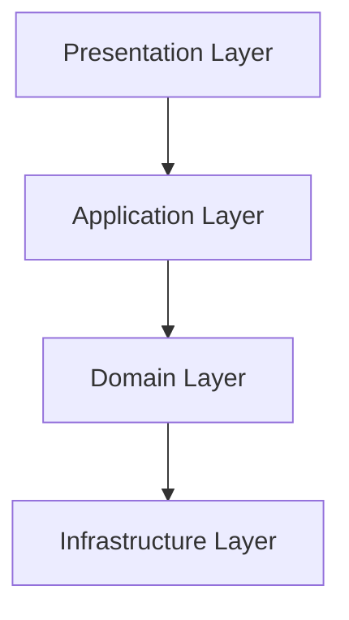

# Enterprise Java EE Web Application

[](https://github.com/m-feliciano/servlets)
[](https://opensource.org/license/mit)
[](https://adoptopenjdk.net/)
[](https://github.com/m-feliciano/servlets)

A production-ready Java EE application demonstrating clean architecture principles with JWT authentication, multi-level caching, and comprehensive testing. Built with Java 17 and modern enterprise patterns.

## Features

- JWT Authentication with role-based access control
- Multi-level caching system with user isolation
- Clean Architecture across 106 classes in 4 layers
- Comprehensive testing with 53 automated tests
- Rate limiting using Leaky Bucket algorithm
- Web scraping framework for external integrations
- Security hardening with XSS protection and input sanitization

## Architecture

Clean Architecture with clear separation of concerns:



## Technology Stack

| Component | Technology | Version |
|-----------|------------|---------|
| Language | Java | 17 |
| Framework | Jakarta EE/CDI | - |
| ORM | Hibernate/JPA | 6.1.7.Final |
| Database | PostgreSQL | 42.4.4 |
| Security | JWT | 4.4.0 |
| Cache | EhCache | 3.9.11 |
| Testing | JUnit + Mockito | 5.10.2 |

## Prerequisites

- Java 17 or higher
- Apache Maven 3.6+
- PostgreSQL 12+
- Apache Tomcat 9.0+

## Installation & Setup

1. **Clone and build**:
```bash
git clone https://github.com/m-feliciano/servlets.git
cd servlets
mvn clean package
```

2. **Setup database**:
```sql
CREATE DATABASE servlets_db;
CREATE USER servlets_user WITH PASSWORD 'your_password';
GRANT ALL PRIVILEGES ON DATABASE servlets_db TO servlets_user;
```

3. **Deploy**: Copy `target/servlets-0.0.1-SNAPSHOT.war` to your Tomcat webapps directory

## Usage

Access the application at `http://localhost:8080/api/{version}/{endoint}`

**Key endpoints**:
- Authentication: `/auth/login`, `/auth/logout`
- Products: `/products/list`, `/products/create`

## Documentation

**English**:
- [Complete Class Analysis](docs/en/COMPLETE_CLASS_ANALYSIS.md) - Detailed analysis of all 106 classes
- [Relationship Diagrams](docs/en/RELATIONSHIP_DIAGRAMS.md) - Visual architecture diagrams  
- [Project Summary](docs/en/PROJECT_SUMMARY.md) - Executive summary

**Português**:
- [Análise Completa de Classes](docs/pt-BR/ANALISE_COMPLETA_CLASSES.md) - Análise detalhada das 106 classes
- [Diagramas de Relacionamentos](docs/pt-BR/DIAGRAMAS_RELACIONAMENTOS.md) - Diagramas visuais da arquitetura
- [Resumo do Projeto](docs/pt-BR/RESUMO_PROJETO.md) - Resumo executivo

## License

This project is licensed under the MIT License - see the [LICENSE](LICENSE) file for details.