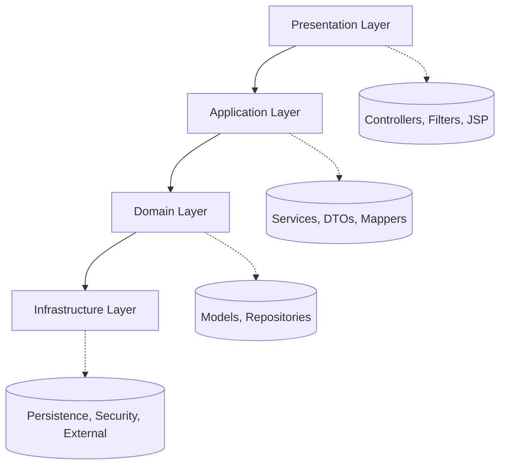
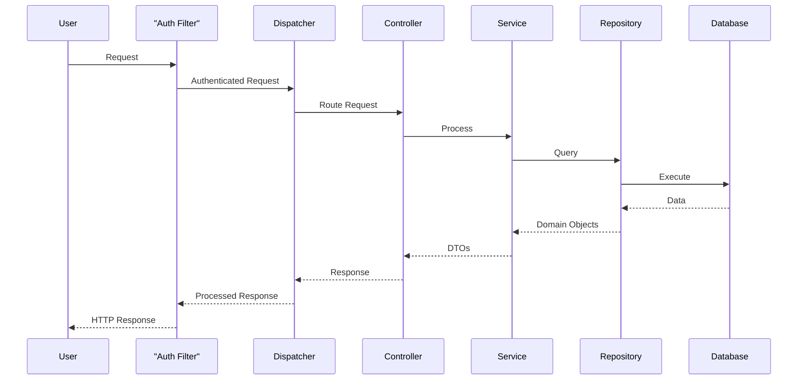
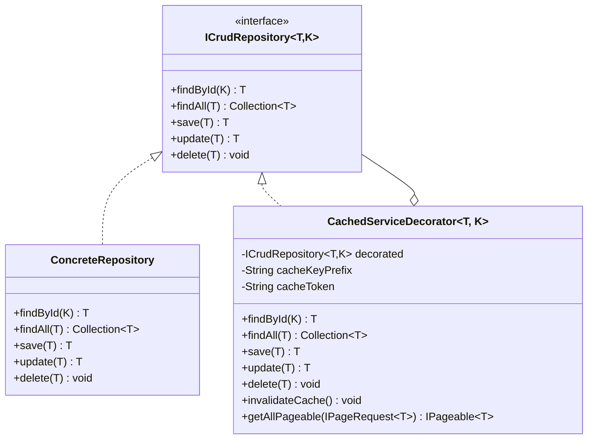

# Full-Stack Java EE Web Application

[](https://github.com/m-feliciano/servlets)
[](https://opensource.org/license/mit)
[](https://adoptopenjdk.net/)

> Java EE enterprise application implementing clean architecture principles with comprehensive security, caching, and
> testing infrastructure.

## Contents

- [Overview](#overview)
- [Architecture](#architecture)
- [Features](#features)
- [Technology Stack](#technology-stack)
- [Development Guide](#development-guide)
- [API Documentation](#api-documentation)
- [Caching Architecture](#caching-architecture)
- [📚 Detailed Flow Documentation](#-detailed-flow-documentation)

## Overview

This project demonstrates a enterprise Java EE application built on clean architecture principles. Designed for
production environments, it provides a scalable foundation with comprehensive security controls, efficient data
management, and optimized performance through strategic caching.

Key architectural goals:

- Clear separation of concerns through layered design
- Decoupled components for maximum testability
- Standardized patterns for consistent development
- Security by design with proper authentication and authorization

### Screenshots

<div align="center">
  
  <p><em>Homepage with product listing and navigation</em></p>

  
  <p><em>Product management interface</em></p>
</div>

## Architecture



**Request Flow:**



## Features

| Feature         | Description                                            |
|-----------------|--------------------------------------------------------|
| Authentication  | JWT-based authentication and role-based access control |
| Validation      | Custom validation framework with annotations           |
| Data Management | Pagination, search, and filtering capabilities         |
| Caching         | Multi-level caching with user isolation                |
| Testing         | Comprehensive unit and integration testing             |
| Logging         | Structured logging with SLF4J and Logback              |
| Architecture    | Layered MVC with clear separation of concerns          |

## Technology Stack

| Component | Technology    | Version      |
|-----------|---------------|--------------|
| Language  | Java          | 17           |
| ORM       | Hibernate/JPA | 6.2.7.Final  |
| Server    | Tomcat        | 9            |
| Database  | PostgreSQL    | 42.5.4       |
| Testing   | JUnit/Mockito | 5.9.2/4.11.0 |
| Logging   | SLF4J/Logback | 2.0.7/1.4.7  |
| Web       | Servlet API   | 4.0.1        |
| Utilities | Lombok        | 1.18.26      |

## Package Structure

```text
com.dev.servlet/
│
├─── adapter/
│    └─── internal/
│
├─── config/
│
├─── controller/
│    └─── base/
│
├─── core/
│    ├─── annotation/
│    ├─── builder/
│    ├─── cache/
│    ├─── exception/
│    ├─── interfaces/
│    ├─── listener/
│    ├─── mapper/
│    ├─── util/
│    └─── validator/
│
├─── domain/
│    ├─── model/
│    │    └─── enums/
│    ├─── repository/
│    └─── service/
│         └─── internal/
│              └─── proxy/
│
├─── transfer/
│    ├─── dto/
│    ├─── records/
│    ├─── request/
│    └─── response/
│
├─── infrastructure/
│    ├─── external/
│    │    └─── webscrape/
│    ├─── persistence/
│    │    ├─── dao/
│    │    └─── internal/
│    └─── security/
│         └─── wrapper/
```

## Development Guide

### Prerequisites

- Java 17+
- Maven 3.x
- PostgreSQL
- Tomcat 9

### Setup Instructions

1. Clone repository: `git clone https://github.com/m-feliciano/servlets.git`
2. Configure database in `src/main/resources/META-INF/persistence.xml`
3. Build: `mvn clean install`
4. Deploy WAR file to Tomcat
5. Access: `http://localhost:8080/api/v1/login/form`

### Configuration Files

- Database: `src/main/resources/META-INF/persistence.xml`
- Application: `src/main/resources/app.properties`
- SQL scripts: `src/main/resources/META-INF/sql`

## API Documentation

Endpoints follow the pattern: `/api/v{version}/{resource}/{action}`

### Core Endpoints

#### Product API

| Method | Endpoint                    | Auth     | Description       |
|--------|-----------------------------|----------|-------------------|
| GET    | /api/v1/product/list        | Required | List all products |
| GET    | /api/v1/product/list/{id}   | Required | Product details   |
| POST   | /api/v1/product/create      | Required | Create product    |
| POST   | /api/v1/product/update/{id} | Required | Update product    |
| POST   | /api/v1/product/delete/{id} | Required | Delete product    |

#### User API

| Method | Endpoint                  | Auth     | Description       |
|--------|---------------------------|----------|-------------------|
| POST   | /api/v1/user/update/{id}  | Required | Update user       |
| POST   | /api/v1/user/delete/{id}  | Admin    | Delete user       |
| POST   | /api/v1/user/registerUser | Public   | Register new user |
| GET    | /api/v1/user/list/{id}    | Required | User details      |

#### Authentication API

| Method | Endpoint                   | Auth     | Description       |
|--------|----------------------------|----------|-------------------|
| GET    | /api/v1/login/form         | Public   | Login form        |
| POST   | /api/v1/login/login        | Public   | Perform login     |
| POST   | /api/v1/login/logout       | Required | Perform logout    |
| GET    | /api/v1/login/registerPage | Public   | Registration form |

## Caching Architecture

The application implements an advanced caching system using the Decorator pattern to optimize performance without
modifying core service code.

### Implementation

- Uses Ehcache for in-memory storage
- Implements time-based expiration (configurable via properties)
- Supports manual and automatic cache invalidation
- Provides user-specific cache isolation through tokens
- Supports complex objects, collections, and pagination
- Efficiently manages cache lifecycle with automatic cleanup of unused entries

### Core Components

- **CacheUtils**: Central utility that manages cache lifecycle, with support for CRUD operations on token-isolated
  caches
- **CachedServiceDecorator**: Implements the Decorator pattern to add caching capabilities to any repository without
  modifying existing code
- **Service Proxies**: Utilize the decorator to intercept calls and apply caching strategies

### Advanced Features

- Key prefix caching for logical grouping of entries
- Deep cloning of objects to prevent state leakage
- Support for paginated queries with pagination-parameter-aware cache keys
- Automatic cleanup of idle caches to optimize memory usage

### Decorator Pattern


## 📚 Detailed Flow Documentation

For in-depth understanding of the application's internal workings, consult the specialized documentation:

### [📋 Complete Request Flow - Product Listing](./docs/FLUXO_REQUISICAO_LISTAGEM_PRODUTOS.md) *(Portuguese)*
Detailed step-by-step documentation of the complete product listing request flow, explaining:
- **Filter chain**: PasswordEncryptFilter → XSSFilter → AuthFilter
- **Authentication processing**: Token validation and authorization
- **Routing**: ServletDispatcher → HttpExecutor → Controllers
- **Service layers**: Proxy with cache → Implementation → DAO
- **Response processing**: JSP preparation and rendering

### [📊 Sequence Diagrams and Performance](./docs/DIAGRAMA_SEQUENCIA_LISTAGEM_PRODUTOS.md) *(Portuguese)*
Visual diagrams and performance analysis, including:
- **Complete UML sequence diagram** of the flow
- **Detailed timeline** with typical execution times
- **Optimization points** and performance strategies
- **Simplified flow** by architectural layers

### [📖 Documentation Overview](./docs/README.md) *(Portuguese)*
Centralized index of all available technical documentation, with:
- **Usage guides** for each type of documentation
- **Application architecture** in detail
- **Security configurations** and important considerations
- **Performance metrics** and monitoring

This documentation is especially useful for:
- **New developers** understanding the architecture
- **Debugging and troubleshooting** performance issues
- **Optimization** of specific components
- **Maintenance** and code evolution