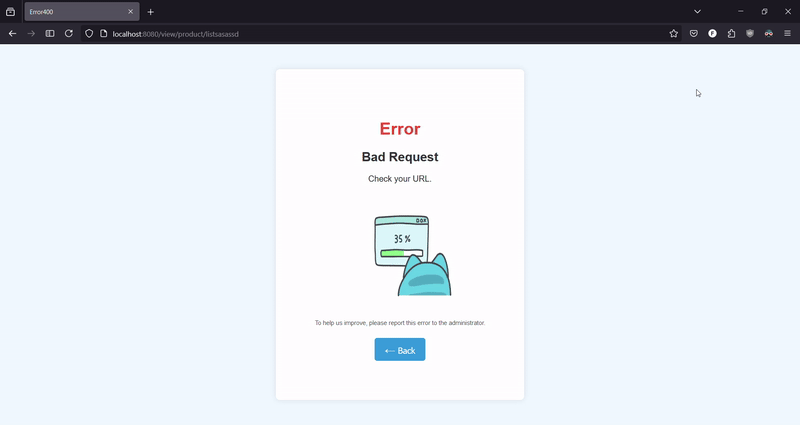

# Full-Stack Java Web Application

This project is a comprehensive Java/JSP web application.
It follows the Model-View-Controller (MVC) architecture and uses the Java EE stack.
I've used the latest Java features and best practices to build this application.

## Table of Contents

- [Technology Stack](#tech-stack)
- [URL Design](#url-design)
- [Layout](#Some-layouts)
- [Packages](#packages)
- [Setup Instructions](#setup-instructions)
- [Notes](#notes)

## Tech Stack

- **Java (JDK 17)**: Core programming language.
- **Hibernate (ORM)**: Simplifies database interactions.
- **Tomcat 9 (Server)**: Web server and servlet container.
- **PostgreSQL (Database)**: Open-source relational database management system.
- **Criteria API**: Type-safe way to build database queries.

## URL Design

The URL structure is designed to be RESTful and easy to understand.

- `{context}/view/{path}/{service}/?{query}`

The URL structure is as follows:

- `{context}`: The application context path e.g., `https://your-domain.com/view/`.
- `{path}`: The controller path.
- `{service}`: The service to be performed.
- `{query}`: The query parameters if needed.

Example GET:

- `server/view/product/` - List all products
- `server/view/product/?id=1` - Get product by ID

Example POST:

- `server/view/product/update` - Update product

Example of controller:

```java

@Controller(path = "/product")
public final class ProductController extends BaseController<Product, Long> {

    // POST /product/create
    @RequestMapping(value = CREATE, method = "POST")
    public IHttpResponse<Void> create(Request request) {
        ProductDTO product = this.getModel().create(request);
        // Created
       return super.newHttpResponse(201, null, super.redirectTo(product.getId()));
    }

    // GET /product/{id}
    @RequestMapping(value = "/{id}", method = "GET")
    public IHttpResponse<ProductDTO> listById(Request request) throws ServiceException {
        ProductDTO product = this.getModel().getById(request);
        // OK
        return super.newHttpResponse(200, product, super.forwardTo("formListProduct"));
    }

   // Superclass method
   protected <U> IHttpResponse<U> newHttpResponse(int status, U response, String nextPath) {
      return HttpResponse.<U>newBuilder().statusCode(status).body(response).next(nextPath).build();
   }
}
```

## Some layouts

### Home Page

#### `/product/?page=1&limit=3&sort=id&order=asc`


#### Tips:

- *Sorting*: `sort=<field>&order=<asc|desc>&page=<page>&limit=<size>`
- *Searching*: `q=<query>&k=<field>`

Sample URLs:

- `/product/?page=1&limit=5&sort=id&order=desc`
- `/product/?q=macbook+pro&k=name`

Default values can be changed in the `app.properties` file.

### Product

#### `/product/?id={id}`


### Info Page

[comment]: <> (Found on the web, author unknown)


## Packages

```
C:.
├───main
│   ├───java
│   │   └───com
│   │       └───dev
│   │           └───servlet
│   │               ├───builders 
│   │               ├───controllers    (REST controllers)
│   │               ├───dao            (Data Access Object)
│   │               ├───dto            (Data Transfer Object)
│   │               ├───filter         (Servlet filters)
│   │               │   └───wrappers   (Request wrappers)
│   │               ├───interfaces     (Contracts)
│   │               ├───listeners      (Servlet listeners)
│   │               ├───mapper         (Object mapper)
│   │               ├───model          (Service classes)
│   │               │   └───shared
│   │               ├───pojo           (Plain Old Java Object)
│   │               │   ├───enums
│   │               │   └───records    (Immutable classes)
│   │               ├───providers      (Service providers)
│   │               └───utils          (Utility classes)
│   ├───resources
│   │   └───META-INF
│   │       └───sql                 (Database scripts)
│   └───webapp
│       ├───assets
│       │   └───images
│       ├───css                    (CSS styles)
│       ├───js
│       ├───META-INF
│       ├───web
│       │   └───WEB-INF
│       └───WEB-INF
│           ├───fragments          (Reusable JSP fragments)
│           ├───routes             (URL mappings)
│           └───view               (JSP views)
│               ├───components     (Reusable JSP components)
│               │   └───buttons
│               └───pages          (JSP pages)
│                   ├───category
│                   ├───inventory
│                   ├───product
│                   └───user
└───test
    └───java
        └───servlets
            └───auth

```

## Setup Instructions

1. Clone the repository:
    ```sh
    git clone https://github.com/m-feliciano/servlets.git
    ```
2. Navigate to the project directory:
    ```sh
    cd servlets
    ```
3. Build the project using Maven:
    ```sh
    mvn clean install
    ```
4. Create a new database in PostgreSQL:
    ```docker
   ## create network
    docker network create -d bridge <network-name>
    
    ## run container (example)
    docker run --name <container-name> \
    --network=<network-name> -p 5432:5432 \
    -e "POSTGRES_USER=<user>" \
    -e "POSTGRES_PASSWORD=<password>" \
    -d postgres
    
    ## exec into container
    docker exec -it <container-name> psql -U postgres
    ## create table
    
    ## etc
    # The scripts to create the database are in the `resources/META-INF/sql` folder.
    # The database connection is set in the `resources/META-INF/persistence.xml` file.
    ```

5. Setting up the database:
    - Run the scripts in the `resources/META-INF/sql` folder to create the tables and insert initial data.
    - Update the `persistence.xml` file with your database credentials.
    - Update the `app.properties` file as needed.
      <br><br>
6. Deploy the application to Tomcat:
    - Install Tomcat 9 on your machine.
    - Copy the generated WAR file to the Tomcat `webapps` directory.
    - Start the Tomcat server.
      <br><br>
7. Usage Instructions
    - Access the application at `<server>/view/<context-path>` (e.g., `http://localhost:8080/view/login/form`).

## Notes

***Note***: This project was initially created years ago to learn Java EE, core Servlet/JSP, and JPA. It has been
updated to incorporate the latest Java features and best practices.

There is a lot of room for improvement,
like refactoring the frontend joining the files into a single one using `JSP fragments`,
and `JSTL` to render the content dynamically.

[Back to top](#full-stack-java-web-application)