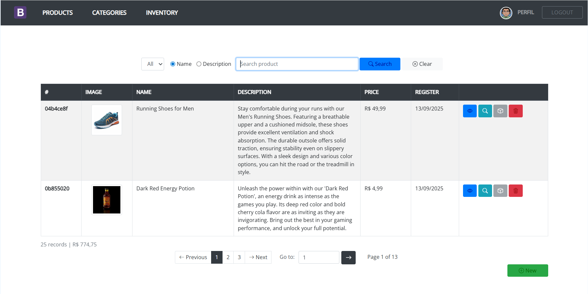

# Product Management System (Servlets)

>This project is a high-quality Java EE enterprise web application that implements Clean Architecture with a focus on separation of concerns, robust security, efficient caching, and testability. The application demonstrates Java development best practices for production systems.

[](#) [](#) [](#) [](#) [](LICENSE)

## Overview
- Name: Product Management System
- Version: 3.0.0 (api: v1)
- Author: Marcelo Feliciano
- Style: Clean-layered architecture (Adapter, Controller, Core, Domain, Infrastructure, Config)
- Focus: Maintainability, security, performance (caching/rate‑limit), and testability

## Features
- RESTful endpoints for Products, Categories, Users, Inventory, and Login
- JWT authentication with security filters (XSS sanitization, password encryption)
- Multi‑level caching (Ehcache) and service‑level cache decorator
- Rate limiting (Leaky Bucket) with configurable switches
- JPA/Hibernate ORM with PostgreSQL + pagination & sorting abstractions
- DTO mapping and validation with custom annotations
- External integration via OkHttp (web scraping client)
- Extensive utilities for URI parsing, crypto, formatting, reflection, and more

## 🛠️ Technology Stack

| Component   | Technology               | Version/Notes                                    |
|-------------|--------------------------|--------------------------------------------------|
| ☕ Language  | Java                     | 17                                               |
| 🌐 Servlet  | Servlet API              | 4.0.1 (javax.*)                                  |
| 🧩 CDI      | Weld / CDI API           | 2.4.8.Final / 1.2                                |
| 🗄️ ORM     | Hibernate ORM            | 6.1.7.Final (+ hibernate-entitymanager 5.6.15)   |
| 🐘 Database | PostgreSQL JDBC          | 42.4.4                                           |
| 🔐 Security | Auth0 java-jwt           | 4.4.0                                            |
| ⚡ Cache     | Ehcache                  | 2.6.11 and 3.9.11; hibernate-ehcache 5.6.15      |
| 🧪 Testing  | JUnit Jupiter / Mockito  | JUnit dep: RELEASE (prop 5.10.2) / 5.14.2, 5.2.0 |
| 📦 HTTP     | OkHttp                   | 4.12.0                                           |
| 🔣 JSON     | Jackson (core/databind)  | 2.19.0                                           |
| 🧱 Logging  | SLF4J / Logback          | 2.0.9 / 1.5.6                                    |
| 🧾 JSP/JSTL | JSTL / Taglibs Standard  | 1.2 / 1.2.5                                      |
| ♻️ Others   | Lombok / mchange-commons | 1.18.36 / 0.2.20                                 |

## Architecture
- adapter/: Servlet dispatching, HTTP execution, execution‑time logging
- controller/: REST controllers and base router/controller abstractions
- core/: annotations, validators, mappers, cache decorators, utilities, listeners
- domain/: entities, enums, repositories, services (interfaces and implementations), DTOs
- infrastructure/: persistence (DAOs, pagination), security (filters/wrappers), external clients
- config/: CDI producers (e.g., EntityManager)

## Request Flow

```
1. 🌐 Browser → AuthFilter (validates JWT)
2. 🛡️ AuthFilter → XSSFilter (sanitizes input)
3. 🔧 XSSFilter → ServletDispatcher (routes)
4. 📋 Dispatcher → BaseController (validates)
5. 🎯 BaseController → ProductController (executes)
6. 🏭 Controller → ProductService (processes)
8. 💾 Service → ProductDAO (data access)
9. 🗄️ DAO → PostgreSQL (queries)
10. ↩️ Response travels reverse path
```
## 📖 Screenshots

<div align="center">
  
  <p><em>Homepage with product listing</em></p>

  
  <p><em>Product management interface</em></p>
</div>


## Quickstart
Prerequisites
- Java 17+
- Maven 3.6+
- PostgreSQL running and reachable

Build
- mvn clean package

Deploy
- Deploy target/servlets-0.0.1-SNAPSHOT.war to your Servlet container (Tomcat, WildFly, etc.)

Local defaults
- Base URL: http://localhost:8080
- API base: /api/v1
- Default list: api/v1/product/list/?page=1&limit=4&sort=id&order=asc

## Configuration
Main file: src/main/resources/app-dev.properties
- env: development or production
- host, port, context: server base and API path
- api.version: versioned routes (e.g., v1)
- auth.authorized: whitelisted controllers for authentication
- security.encrypt.key, security.encrypt.algorithm: password encryption
- security.jwt.key: JWT signing key
- rate.limit.enabled: toggle rate limiting
- cache.timeout.minutes: cache TTL
- pagination.*: default paging/sorting
- homepage, loginPage: convenience routes
- scrape.product.url: external product scraping endpoint

Use app-prod.properties for production overrides.

## Testing
- Run tests: mvn test
- Coverage spans adapters, controllers, services, security filters, rate limiter, and utilities.

## Audit logging (current `AuditService`)

This service emits a single JSON object per audit record with these fields:

- `schemaVersion` — fixed to `"1.0"`.
- `event` — domain event name (example: `product:list`).
- `timestamp` — ISO 8601 instant when the record was created.
- `correlationId` — UUID generated per audit call.
- `outcome` — `success | failure | warning`.
- `payload` — the provided `AuditPayload` serialized as a nested object (contains `input` and `output` where applicable).
- `userId` — extracted from the token if present.

Example audit log for a successful product listing operation:

```json
{
  "schemaVersion": "1.0",
  "correlationId": "61aa3a37-26aa-44df-b8eb-cc564a5a8603",
  "event": "product:list",
  "outcome": "success",
  "timestamp": "2025-10-20T04:13:59.125748900Z",
  "payload": {
    "input": {
      "sort": {
        "field": "id",
        "direction": "ASC"
      },
      "initialPage": 1,
      "pageSize": 5,
      "filter": {
        "user": {
          "id": "f6fbba83",
          "perfis": [
            2
          ]
        }
      },
      "firstResult": 0
    },
    "output": {
      "content": [
        {
          "id": "009b61b0-7645-4815-b793-d59092f55e82",
          "name": "Running Shoes for Men",
          "description": "Stay comfortable during your runs with our Men's Running Shoes. Featuring a breathable upper and a cushioned midsole, these shoes provide excellent ventilation and shock absorption. The durable outsole offers solid traction, ensuring stability even on slippery surfaces. With a sleek design and various color options, you can hit the road or the treadmill in style.",
          "url": "https://web-scraping.dev/assets/products/men-running-shoes.webp",
          "status": "A",
          "registerDate": 1760324400000,
          "price": 49.99
        },
        {
          "id": "032ffeaf-70d0-43b7-a64e-181ddaadee69",
          "name": "Cat-Ear Beanie",
          "description": "Add a touch of whimsy to your winter wardrobe with our Cat Ear Beanie. Crafted from warm, soft material, this cozy beanie features adorable cat ears that stand out, making it the perfect accessory for cat lovers and fashion enthusiasts alike. Available in a variety of colors like black, grey, white, pink, and blue, this beanie not only keeps you warm but also adds a playful element to your outfit. Wear it for a casual day out, or make it your go-to accessory for those chilly evening walks. Stay warm, look cute, and let your playful side shine with our Cat Ear Beanie.",
          "url": "https://web-scraping.dev/assets/products/cat-ear-beanie-grey.webp",
          "status": "A",
          "registerDate": 1760324400000,
          "price": 14.99
        },
        {
          "id": "049c8d3b-cd6c-4bbd-bbd0-ec0230319330",
          "name": "Red Energy Potion",
          "description": "Elevate your game with our 'Red Potion', an extraordinary energy drink that's as enticing as it is effective. This fiery red potion delivers an explosive berry flavor and an energy kick that keeps you at the top of your game. Are you ready to level up?",
          "url": "https://web-scraping.dev/assets/products/red-potion.webp",
          "status": "A",
          "registerDate": 1760324400000,
          "price": 4.99
        },
        {
          "id": "0655724b-a709-42b4-9af0-3d79dc158455",
          "name": "Women's High Heel Sandals",
          "description": "Step out in style with our Women's High Heel Sandals. These sandals feature a strappy design that adds a touch of elegance to any outfit. The comfortable footbed and sturdy heel make them perfect for a night out, while the buckle closure ensures a secure fit. Choose from black, red, nude, or silver to complement your wardrobe.",
          "url": "https://web-scraping.dev/assets/products/women-sandals-beige-1.webp",
          "status": "A",
          "registerDate": 1760324400000,
          "price": 59.99
        },
        {
          "id": "0f59c8bc-7039-4ba8-98c0-b6b3f594fd99",
          "name": "Dark Red Energy Potion",
          "description": "Unleash the power within with our 'Dark Red Potion', an energy drink as intense as the games you play. Its deep red color and bold cherry cola flavor are as inviting as they are invigorating. Bring out the best in your gaming performance, and unlock your full potential.",
          "url": "https://web-scraping.dev/assets/products/darkred-potion.webp",
          "status": "A",
          "registerDate": 1760324400000,
          "price": 4.99
        }
      ],
      "currentPage": 1,
      "pageSize": 5,
      "totalElements": 65,
      "sort": {
        "field": "id",
        "direction": "ASC"
      },
      "totalPages": 13
    }
  }
}
```

## Project Structure

```
com.dev.servlet/
├── domain/          # 🎯 Business rules (25 classes)
│   ├── model/       # Entities: User, Product, Category, Inventory
│   ├── service/     # Service interfaces and implementations
│   └── repository/  # Repository interfaces
├── controller/      # 🌐 Web layer (6 classes)
│   └── base/        # Base controllers with routing
├── infrastructure/  # 🔧 Infrastructure (30 classes)
│   ├── persistence/ # DAOs and pagination
│   ├── security/    # Security filters and wrappers
│   └── external/    # External services (web scraping)
├── adapter/         # 🔌 Adapters (6 classes)
│   └── internal/    # HTTP executors and dispatchers
├── core/           # ⚙️ Core utilities (38 classes)
│   ├── cache/      # Decorated cache system
│   ├── util/       # Various utilities
│   ├── validator/  # Validation framework
│   └── annotation/ # Custom annotations
└── config/         # ⚙️ Configuration (1 class)
```

## 📄 License

MIT License - see [LICENSE](LICENSE) file for details.