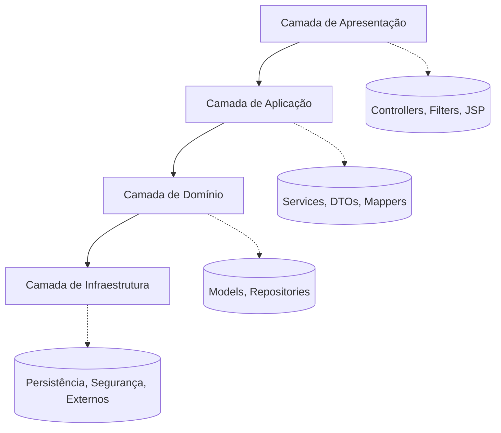
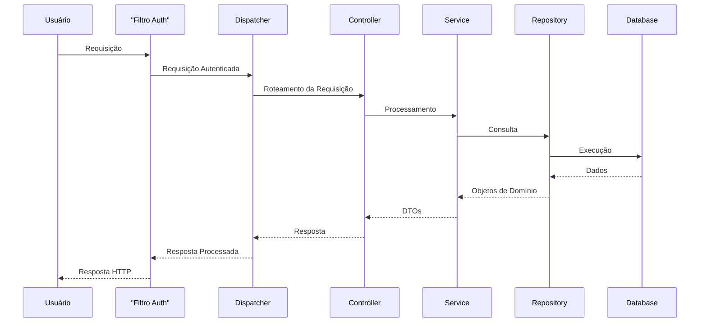
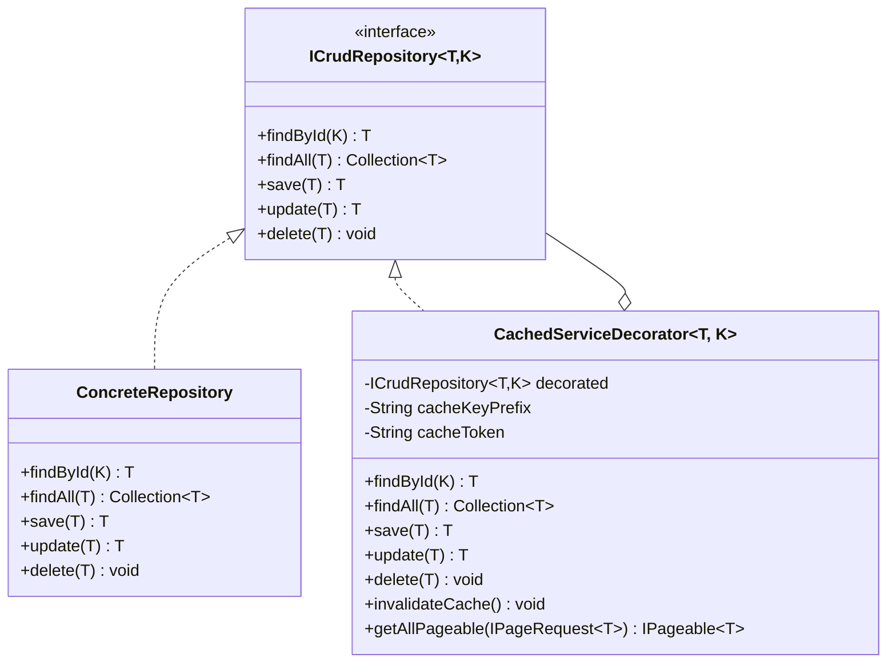

# Aplicação Web Full-Stack Java EE

> Aplicação empresarial Java EE implementando princípios de arquitetura limpa com infraestrutura abrangente de
> segurança, cache e testes.

## Conteúdo

- [Visão Geral](#visão-geral)
- [Arquitetura](#arquitetura)
- [Funcionalidades](#funcionalidades)
- [Stack Tecnológica](#stack-tecnológica)
- [Guia de Desenvolvimento](#guia-de-desenvolvimento)
- [Documentação da API](#documentação-da-api)
- [Arquitetura de Cache](#arquitetura-de-cache)
- [📚 Documentação Detalhada do Fluxo](#-documentação-detalhada-do-fluxo)

## Visão Geral

Este projeto demonstra uma aplicação empresarial Java EE construída com base em princípios de arquitetura limpa.
Projetada para ambientes de produção, fornece uma base escalável com controles de segurança abrangentes, gerenciamento
eficiente de dados e desempenho otimizado através de cache estratégico.

Objetivos arquiteturais principais:

- Clara separação de responsabilidades através de design em camadas
- Componentes desacoplados para máxima testabilidade
- Padrões padronizados para desenvolvimento consistente
- Segurança por design com autenticação e autorização adequadas

### Capturas de Tela

  
  
<em>Página inicial com listagem de produtos e navegação</em>

  
  
<em>Interface de gerenciamento de produtos</em>

## Arquitetura

**Fluxo de Requisição:**

## Funcionalidades

| Funcionalidade         | Descrição                                                  |
|------------------------|------------------------------------------------------------|
| Autenticação           | Autenticação baseada em JWT e controle de acesso por papel |
| Validação              | Framework de validação personalizado com anotações         |
| Gerenciamento de Dados | Capacidades de paginação, busca e filtragem                |
| Cache                  | Cache multinível com isolamento por usuário                |
| Testes                 | Testes unitários e de integração abrangentes               |
| Logging                | Logging estruturado com SLF4J e Logback                    |
| Arquitetura            | MVC em camadas com clara separação de responsabilidades    |

## Stack Tecnológica

| Componente     | Tecnologia    | Versão       |
|----------------|---------------|--------------|
| Linguagem      | Java          | 17           |
| ORM            | Hibernate/JPA | 6.2.7.Final  |
| Servidor       | Tomcat        | 9            |
| Banco de Dados | PostgreSQL    | 42.5.4       |
| Testes         | JUnit/Mockito | 5.9.2/4.11.0 |
| Logging        | SLF4J/Logback | 2.0.7/1.4.7  |
| Web            | Servlet API   | 4.0.1        |
| Utilitários    | Lombok        | 1.18.26      |

## Estrutura de Pacotes

## Guia de Desenvolvimento

### Pré-requisitos

- Java 17+
- Maven 3.x
- PostgreSQL
- Tomcat 9

### Instruções de Configuração

1. Clone o repositório: `git clone https://github.com/m-feliciano/servlets.git`
2. Configure o banco de dados em `src/main/resources/META-INF/persistence.xml`
3. Build: `mvn clean install`
4. Implante o arquivo WAR no Tomcat
5. Acesse: `http://localhost:8080/api/v1/login/form`

### Arquivos de Configuração

- Banco de dados: `src/main/resources/META-INF/persistence.xml`
- Aplicação: `src/main/resources/app.properties`
- Scripts SQL: `src/main/resources/META-INF/sql`

## Documentação da API

Os endpoints seguem o padrão: `/api/v{versão}/{recurso}/{ação}`

### Endpoints Principais

#### API de Produtos

| Método | Endpoint                    | Auth      | Descrição                |
|--------|-----------------------------|-----------|--------------------------|
| GET    | /api/v1/product/list        | Requerido | Listar todos os produtos |
| GET    | /api/v1/product/list/{id}   | Requerido | Detalhes do produto      |
| POST   | /api/v1/product/create      | Requerido | Criar produto            |
| POST   | /api/v1/product/update/{id} | Requerido | Atualizar produto        |
| POST   | /api/v1/product/delete/{id} | Requerido | Excluir produto          |

#### API de Usuários

| Método | Endpoint                  | Auth      | Descrição              |
|--------|---------------------------|-----------|------------------------|
| POST   | /api/v1/user/update/{id}  | Requerido | Atualizar usuário      |
| POST   | /api/v1/user/delete/{id}  | Admin     | Excluir usuário        |
| POST   | /api/v1/user/registerUser | Público   | Registrar novo usuário |
| GET    | /api/v1/user/list/{id}    | Requerido | Detalhes do usuário    |

#### API de Autenticação

| Método | Endpoint                   | Auth      | Descrição              |
|--------|----------------------------|-----------|------------------------|
| GET    | /api/v1/login/form         | Público   | Formulário de login    |
| POST   | /api/v1/login/login        | Público   | Realizar login         |
| POST   | /api/v1/login/logout       | Requerido | Realizar logout        |
| GET    | /api/v1/login/registerPage | Público   | Formulário de registro |

## Arquitetura de Cache

A aplicação implementa um sistema avançado de cache usando o padrão Decorator para otimizar o desempenho sem modificar o
código principal do serviço.

### Implementação

- Usa Ehcache para armazenamento em memória
- Implementa expiração baseada em tempo (configurável via propriedades)
- Suporta invalidação manual e automática do cache
- Fornece isolamento de cache específico por usuário através de tokens
- Suporta objetos complexos, coleções e paginação
- Gerencia eficientemente o ciclo de vida do cache com limpeza automática de entradas não utilizadas

### Componentes Principais

- **CacheUtils**: Utilitário central que gerencia o ciclo de vida do cache, com suporte para operações CRUD em caches
  isolados por token
- **CachedServiceDecorator**: Implementa o padrão Decorator para adicionar capacidades de cache a qualquer repositório
  sem modificar o código existente
- **Proxies de Serviço**: Utilizam o decorator para interceptar chamadas e aplicar estratégias de cache

### Características Avançadas

- Cache por prefixo de chave para agrupamento lógico de entradas
- Clonagem profunda de objetos para evitar vazamento de estado
- Suporte para consultas paginadas com chaves de cache sensíveis a parâmetros de paginação
- Limpeza automática de caches ociosos para otimizar o uso de memória

### Padrão Decorator

## 📚 Documentação Detalhada do Fluxo

Para uma compreensão aprofundada do funcionamento interno da aplicação, consulte a documentação especializada:

### [📋 Fluxo Completo de Requisição - Listagem de Produtos](./docs/FLUXO_REQUISICAO_LISTAGEM_PRODUTOS.md)
Documentação detalhada e passo-a-passo do fluxo completo de uma requisição de listagem de produtos, explicando:
- **Cadeia de filtros**: PasswordEncryptFilter → XSSFilter → AuthFilter
- **Processamento de autenticação**: Validação de tokens e autorização
- **Roteamento**: ServletDispatcher → HttpExecutor → Controllers
- **Camadas de serviço**: Proxy com cache → Implementação → DAO
- **Processamento de resposta**: Preparação e renderização JSP

### [📊 Diagramas de Sequência e Performance](./docs/DIAGRAMA_SEQUENCIA_LISTAGEM_PRODUTOS.md)
Diagramas visuais e análise de performance, incluindo:
- **Diagrama de sequência UML** completo do fluxo
- **Cronologia detalhada** com tempos típicos de execução
- **Pontos de otimização** e estratégias de performance
- **Fluxo simplificado** por camadas arquiteturais

### [📖 Visão Geral da Documentação](./docs/README.md)
Índice centralizado de toda a documentação técnica disponível, com:
- **Guias de uso** para cada tipo de documentação
- **Arquitetura da aplicação** em detalhes
- **Configurações de segurança** e considerações importantes
- **Métricas de performance** e monitoramento

Esta documentação é especialmente útil para:
- **Novos desenvolvedores** entendendo a arquitetura
- **Debug e troubleshooting** de problemas de performance
- **Otimização** de componentes específicos
- **Manutenção** e evolução do código