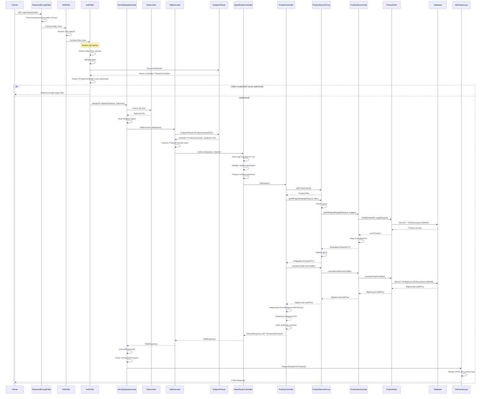
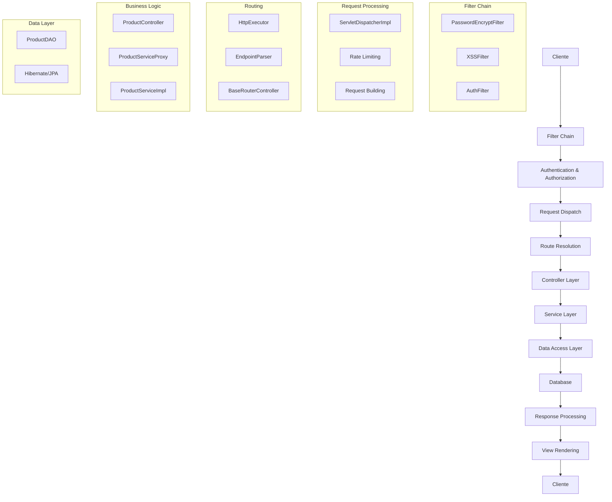

# Diagrama de Sequência - Fluxo de Listagem de Produtos

## Diagrama de Sequência UML

## Fluxo Simplificado por Camadas

## Cronologia Detalhada

| Passo | Componente | Ação | Duração Típica |
|-------|------------|------|----------------|
| 1 | PasswordEncryptFilter | Processar criptografia de senhas | < 1ms |
| 2 | XSSFilter | Sanitizar entrada contra XSS | < 1ms |
| 3 | AuthFilter | Validar token e autorização | 2-5ms |
| 4 | ServletDispatcherImpl | Rate limiting e construção de Request | 1-3ms |
| 5 | HttpExecutor | Parsing e resolução de controller | 1-2ms |
| 6 | BaseRouterController | Mapeamento de rota e validação | 2-3ms |
| 7 | ProductController | Coordenação da lógica de negócio | 5-10ms |
| 8 | ProductServiceProxy | Verificação e gestão de cache | 1-2ms |
| 9 | ProductServiceImpl | Processamento da lógica de negócio | 3-5ms |
| 10 | ProductDAO | Acesso aos dados | 10-50ms |
| 11 | Database | Execução de consultas SQL | 5-100ms |
| 12 | Response Processing | Processamento da resposta | 2-5ms |
| 13 | JSP Rendering | Renderização da view | 5-15ms |

**Tempo Total Típico**: 35-200ms (dependendo da complexidade da consulta e cache)

## Pontos de Otimização

### Cache Hits
- **ProductServiceProxy**: Cache de produtos pode reduzir tempo de 50ms para 2ms
- **Session Cache**: Token validation cache reduz overhead de autenticação

### Database Optimization
- **Indices**: Indices apropriados em campos de filtro
- **Query Optimization**: Consultas otimizadas para paginação
- **Connection Pooling**: Pool de conexões gerenciado pelo Hibernate

### Performance Monitoring
- **Rate Limiting**: Previne sobrecarga do sistema
- **Retry Logic**: Recuperação automática de falhas temporárias
- **Circuit Breaker**: Proteção contra cascateamento de falhas