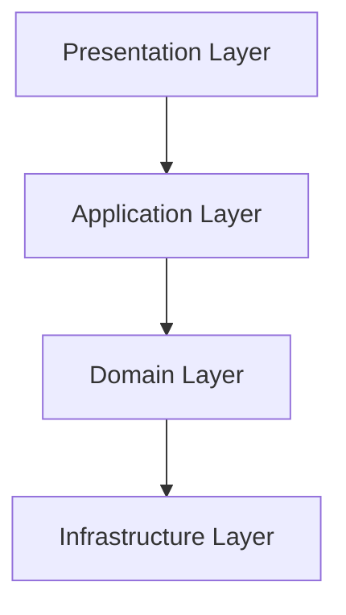

# Project Documentation

Comprehensive technical documentation for the Enterprise Java EE Servlets project in both English and Portuguese.

## Quick Start

### For Developers
1. Start with [Project Summary](en/PROJECT_SUMMARY.md) for overview
2. Review [Relationship Diagrams](en/RELATIONSHIP_DIAGRAMS.md) for architecture  
3. Check [Complete Class Analysis](en/COMPLETE_CLASS_ANALYSIS.md) for implementation details

### Para Desenvolvedores Brasileiros
1. [Resumo do Projeto](pt-BR/RESUMO_PROJETO.md) - Visão geral
2. [Diagramas de Relacionamentos](pt-BR/DIAGRAMAS_RELACIONAMENTOS.md) - Arquitetura
3. [Análise Completa de Classes](pt-BR/ANALISE_COMPLETA_CLASSES.md) - Detalhes técnicos

## Documentation Structure

```
docs/
├── en/                           # English Documentation
│   ├── COMPLETE_CLASS_ANALYSIS.md   # Analysis of all 106 classes
│   ├── RELATIONSHIP_DIAGRAMS.md     # Visual diagrams with Mermaid
│   └── PROJECT_SUMMARY.md           # Executive summary
└── pt-BR/                        # Portuguese Documentation
    ├── ANALISE_COMPLETA_CLASSES.md  # Análise das 106 classes
    ├── DIAGRAMAS_RELACIONAMENTOS.md # Diagramas visuais
    └── RESUMO_PROJETO.md             # Resumo executivo
```

## Architecture Overview

Java EE enterprise application demonstrating Clean Architecture principles:



## Content Overview

### Complete Class Analysis
Analysis of all 106 classes organized by architectural layers with design patterns and technology stack assessment.

### Relationship Diagrams  
Visual system architecture using Mermaid syntax - entity relationships, layer dependencies, cache system, and request flows.

### Project Summary
Executive overview with technical assessment, technology decisions, and quality metrics including 53 passing tests.