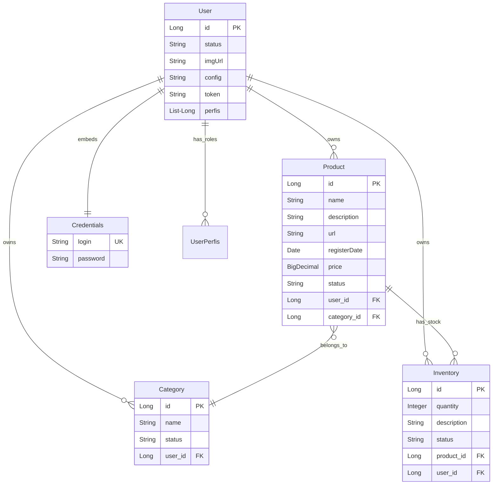
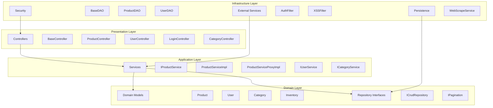
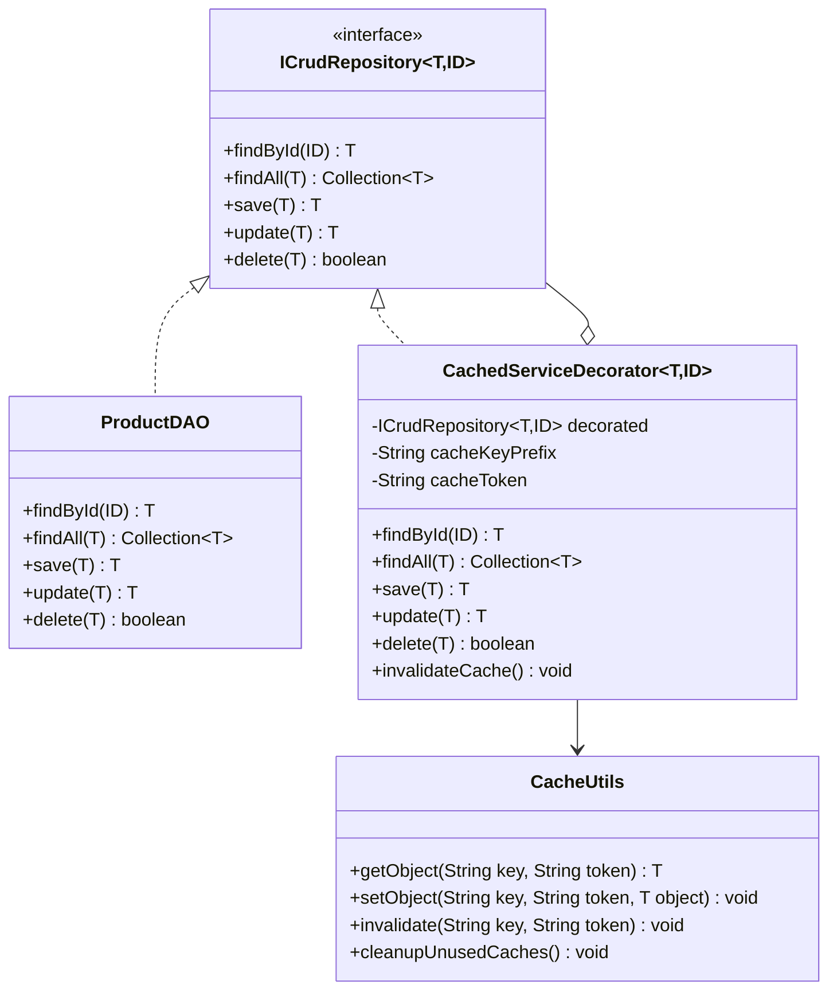
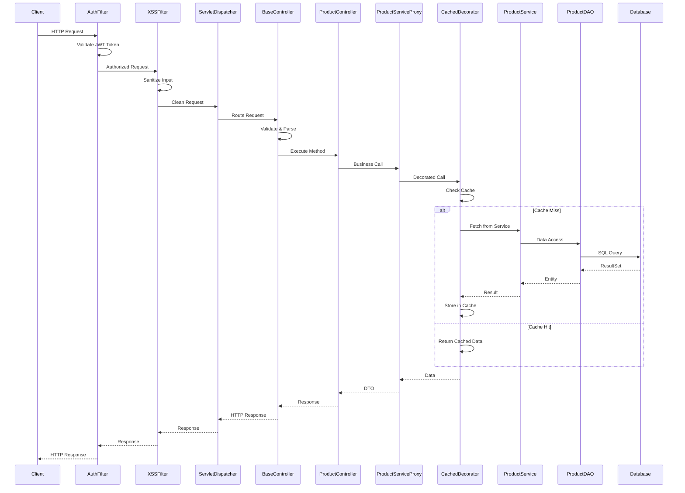
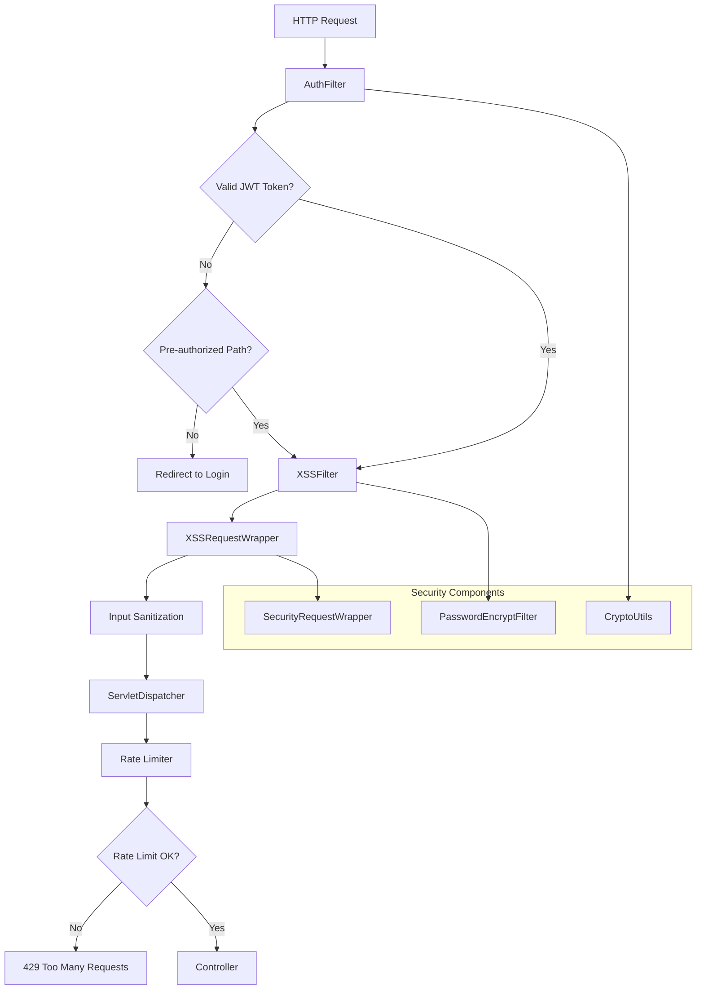
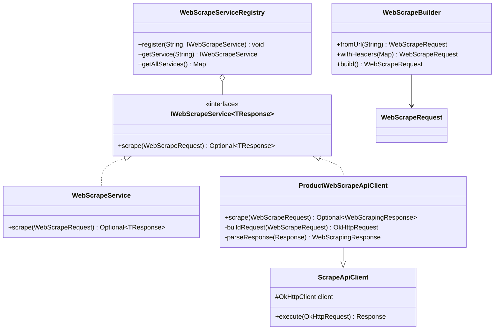
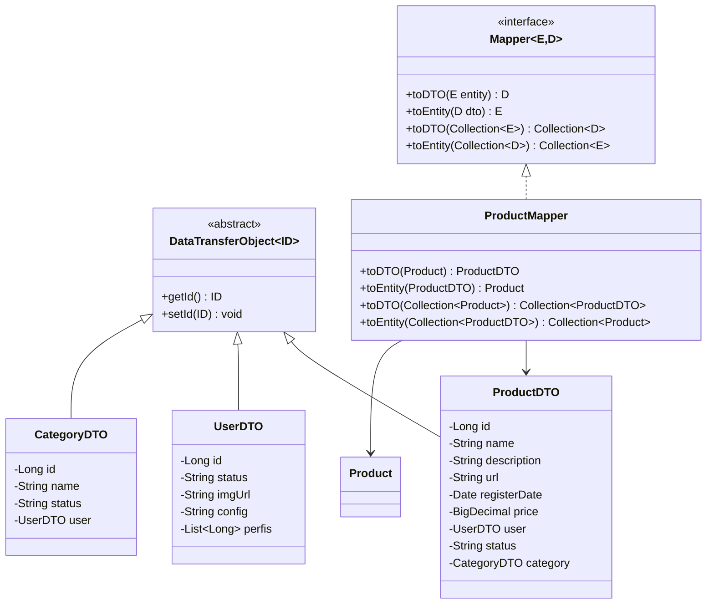
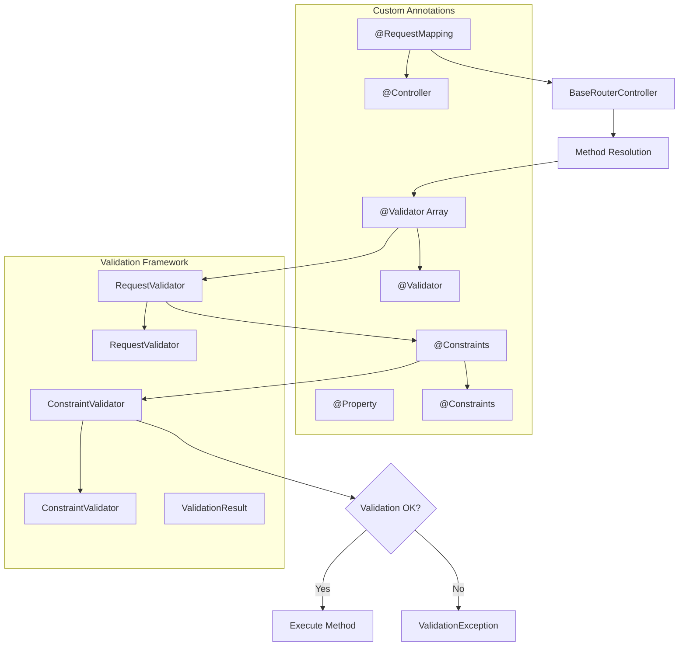
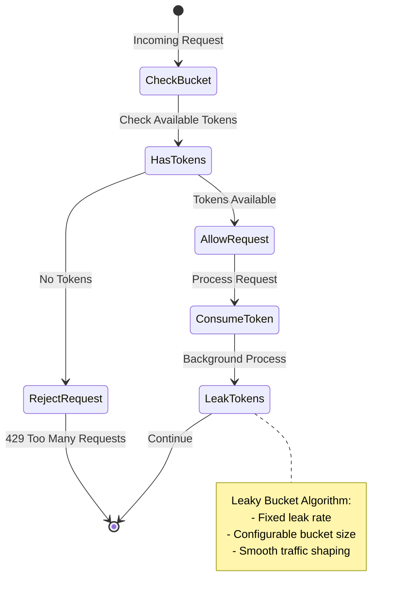
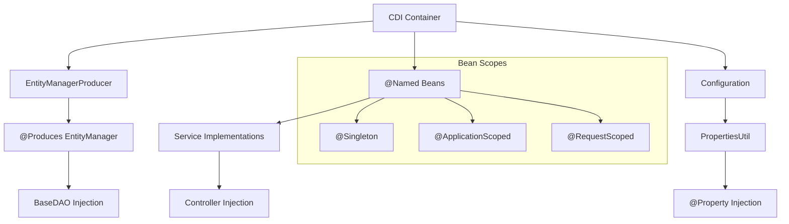

# Class Relationship Diagrams

## 1. Domain Entities Diagram

## 2. Layered Architecture Diagram

## 3. Cache System Diagram (Decorator Pattern)

## 4. Request Flow Diagram

## 5. Security System Diagram

## 6. Web Scraping Architecture Diagram

## 7. DTOs and Mappers Diagram

## 8. Validation and Annotations Diagram

## 9. Rate Limiting Diagram

## 10. Configuration and Dependency Injection Diagram

These diagrams show the main relationships and flows between system classes, demonstrating how Clean Architecture and design patterns work together to create a robust and well-structured application.